# Deployment and Payment setup
 - The app was deployed to [HEROKU](https://id.heroku.com/login)
 - The database was deployed to [ElephantSQL](https://www.elephantsql.com/)
 - The app can be reached by the [Link](https://thailand-guiding-light-2fb0b0e33db8.herokuapp.com/)

## Local deployment
1. Clone the repository.
   - git clone`https://github.com/Kay13051976/Thailand-guiding-light-second.git`
  2. Go to the Thailand-guiding-light-second directory.
     - `cd Thailand-guiding-light-second`
 3. Create a virtual environment.
     - `python3 -m venv venv`
     - `venv/bin/activate`
4. install all dependencies.
     - `pip3 install -r requirements.txt`
5. Create a env.py file
     - `touch env.py`
6. Add th following lines env.py
     - `import os`
     - `os.environ["SECRET_KEY] = your secret key.`
     - `os.environ["DEBUG"] = "True" or "False" depending on whether you are in development or production.`
     - `os.environ["ALLOW_HOSTS] = your domain name.`
     - `os.environ["DATABASE_URL"] = your database url.`
     - `os.environ[CLOUDINARY_CLOUD_NAME] = your cloudinary cloud name.`
     - `os.environ["CLOUDINARY_API_KEY] = your cloudinary api key`
     - `os.environ["CLOUDINARY_API_SECRET] = your cloudinary api secret`
7. Create and migrate the database.
[code image]()
     - `python3 manage.py makemigrations`
     - `python3 manage.py migrate`
     - `After migration, you will need to create a superuser.`
8. Create roles as following:
     - `python3 manage.py createsuperuser`
9. Create roles as following:

For example
`Role.objects.create(name='Customer)`
`Role.objects.create(name='Customer)`
`Role.objects.create(name='Customer)`

10. Set the role for the superuser with the role field with id 3.

  `superuser.profile.role_id = 3`    
  `superuser.save()`
11. Go to Profiles and uncomment the default role. Make new migrations and migrate.
     - python manage.py makemigrations
     - python manage.py migrate

After the following steps, you will ensure that the app is working correctly, and any other user registered in your app will only have access as a customer. The rest of the roles will be controlled by the admin
12. Run the server.
     - python3 manage.py runserver
13. Access the website by the link provided in terminal. Add /admin/ at the end of the link to access the admin panel. If you are using Gitpod, you can skip steps 1-3 by clicking this [link](), and start from step4

## The app was initially deployed to Heroku
### Heroku Deployment

1. Create a Heroku account if you don't already have one.
2. Create a new app on Heroku.
     - Go to the [Heroku](https://id.heroku.com/login)
     - Click on the "New" button.
     - Click on the "Create new app" button.
     - Choose a name for your app.
     - Choose a region.
     - Click on the "Create app" button.
3. In your app go to the "Resources" tab.
     - Add a Heroku Postgres database.
4. In your app, go to the "Setting" tab, press "Reveal Config Vars", and the following config vars if they are not already set:
     - ALLOWED_HOSTS = your heroku domain name.
     - CLOUDINARY_CLOUD_NAME = the cloud name you used when creating your cloudinary account.
     - CLOUDINARY_API_KEY = the api key you got when crated your cloudinary account.
     - CLOUDINARY_API_SECRET = the api secret you got when created your cloudinary account.
     - DATABASE_URL = the url of your heroku postgras database.
     - EMAIL_HOST_USER = the email address you going to use to send emails.
     - DEBUG = True during development, False during production.
     - DISABLE_COLLECTIONSTATIC = 1 during development. Remove this when deploying to production.
     
5. In your app go to the "Deploy" tab.
    - If it's already possible, connect your Heroku account to your GitHub account and then click on the "Deploy" button.
    - If not, you need to copy the Heroku CLI command to connect your Heroku app and your local repository.
      - `heroku git:remote -a <your-heroku-app-name`ุ
6. Go to your local repository.
7. Login to your Heroku account in your terminal and connect your local repository to your heroku app.
     - `heroku login -i` - Enter all your Heroku credentials it will ask for.
     - Paste the command you copied from step 5 into your terminal.
8. Create Procfile.
   This project uses Keroku which is require a Procfile that specifies the commands that are executed by the app on startup. You can use a Procfile to declare a variety of process types, including: Your app's web server. Multiple types 
     - `web: gunicorn social_media_project.wsgi`
9. Create requirements.txt This can be done by running the following command.
     - `pip3 freeze > requirement.txt`
10. Add your commit to Heroku.
11. Push your changes to Heroku.
     - `git push heroku master` or 
     - `git push heroku main`
12. Check your app's logs in heroku dashboard and ensure everything is working.
13. After the development is done, you can change the `Debug` config vars to `False` and remove the `DISABLE_COLLECTSTATIC` config var from the config vars on heroku.
To get Cloudinary cloud name, API key, and API secret:
    1. go to the [Cloudinary website](https://cloudinary.com/users)
    2. Log in your account or sign up if you don't have an account.
    3. Go to the Cloudinary dashboard.
    4. At the top of the page, you will see your cloud name, API key, and API secret.
    5. To reveal API secret, hover over the API key container and click on the button that look like and eye.
    6. Copy these values and paste them into the config vars on Heroku and into your `env.py` file.
## Render Deployment
### Create Database on ElephantSQL
1. Go to [ElephantSQL](https://www.elephantsql.com/) and create a new account.
2. Create a new instance of the database.
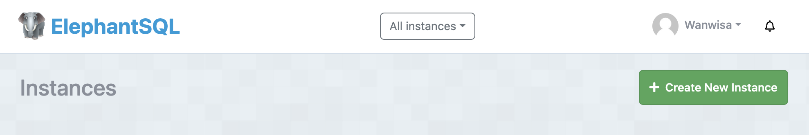
3. Select a name for yor database and select the free plan.
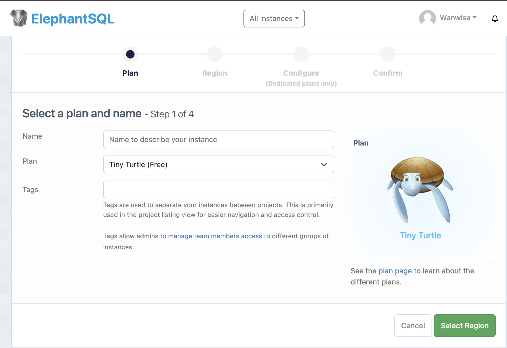
4. Click "Select Region"
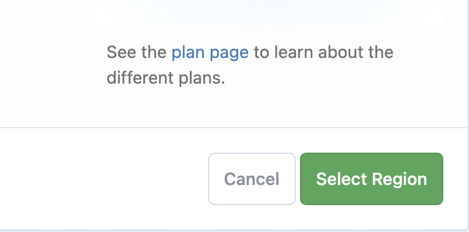
5. Select a region close to you.
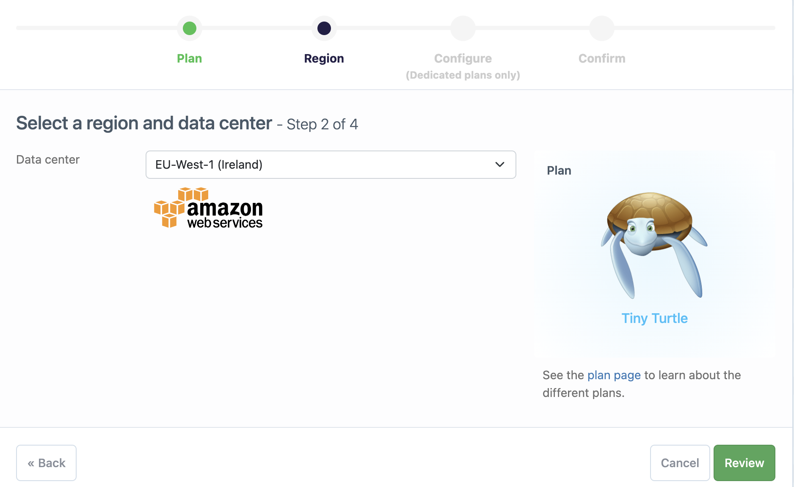
6. Click "Review"

7. Click "create instance"
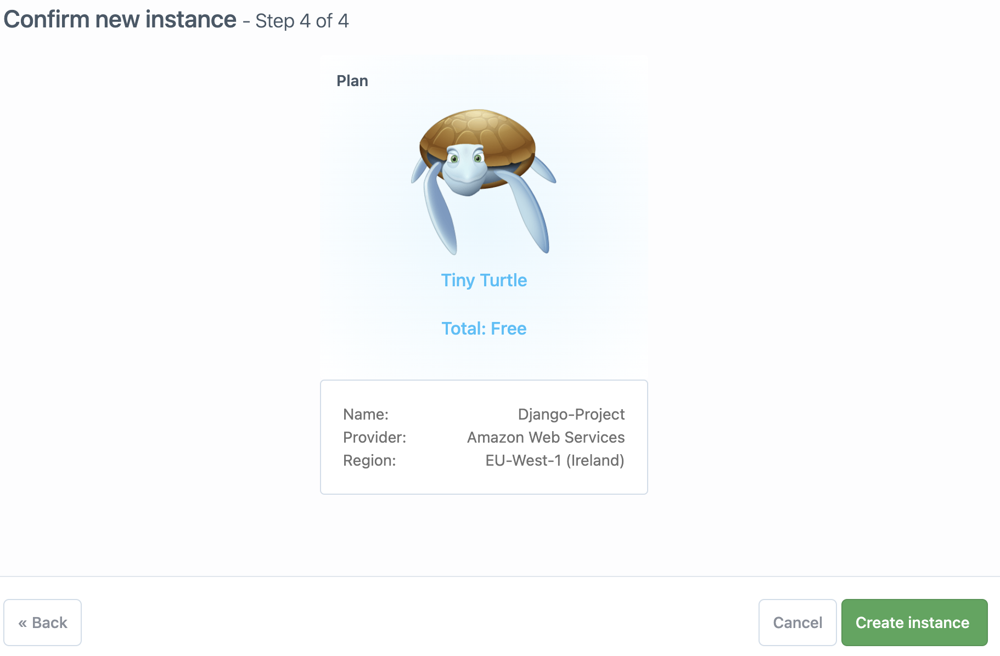
8. Click on the name of your database to open the dashboard.
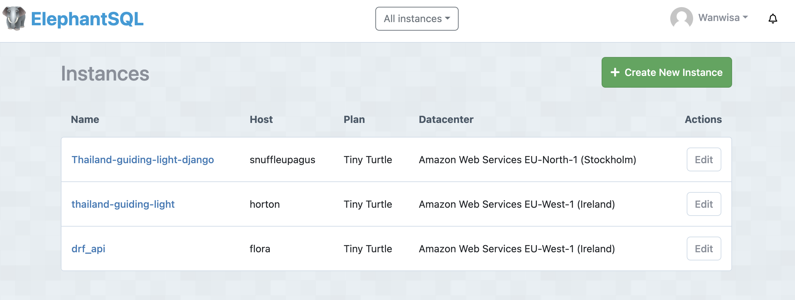
9. You will see the dashboard of your database. You will need the URL of your database to connect it to your Django project.
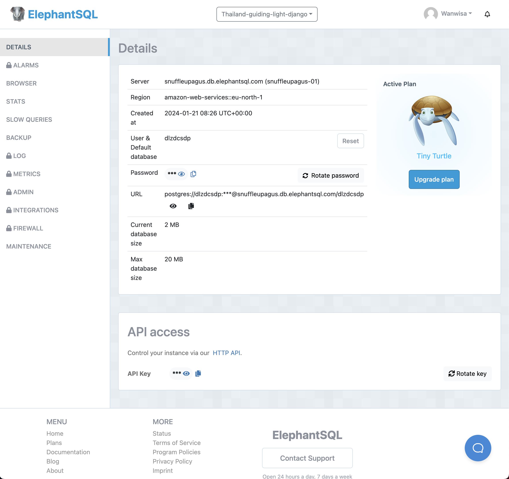

## Create a new app on Heroku
 ### sign up with Heroku then log into your account and go to the Dashboard.
1. Click "New"
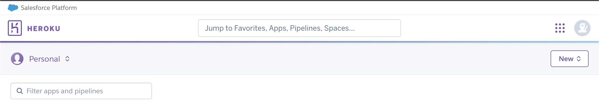
2. Click "Create new app"
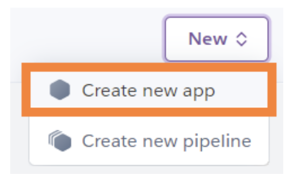
3. Give your app a name and select the region closest to you. When you're done, click "Create app" to confirm.
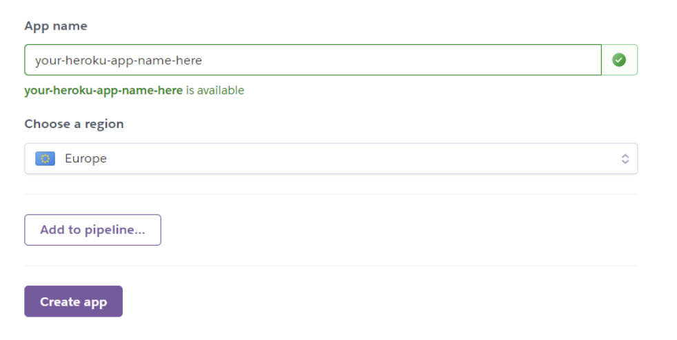
**Heroku app names must be unique. If yours isn't, Heroku will give you a warning that looks like the image below**
4. Navigate to your Heroku dashboard and select the app you have just created.
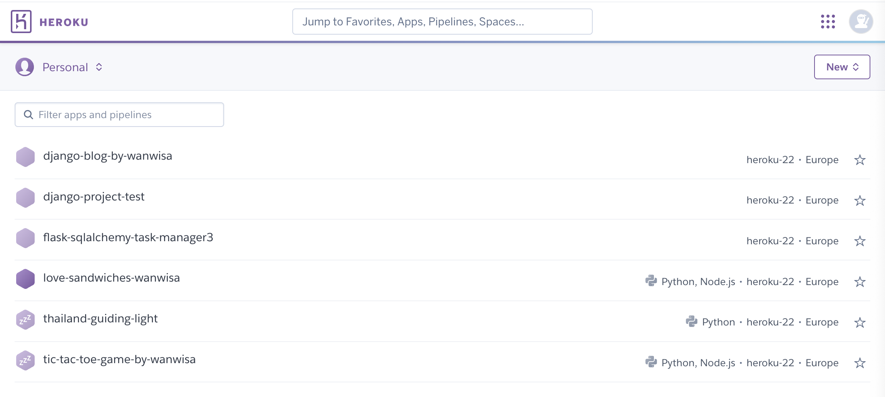
5. On your app dashboard click on the Deploy tab.
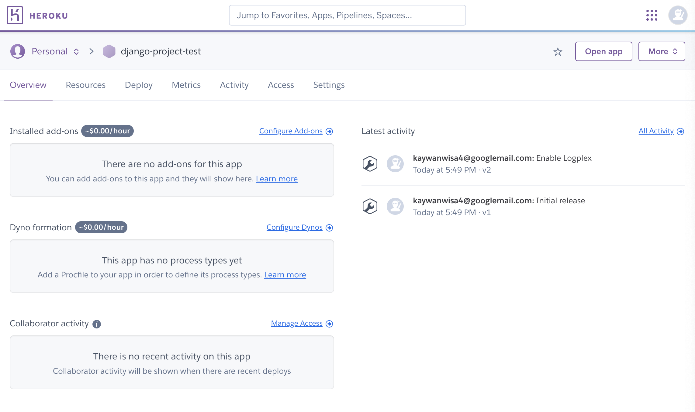
