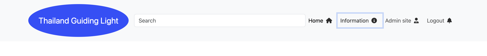

# Feature
## Access to pages according to the user role:
write mark down table

## Main Features:
  - Each page has a navbar 

  Navbar: 
  
- The navbar has two subsection:
     1. User's section, which is visible is visible for all users:
        - if the user is admin 
        
        - if the user is not admin
        

     2. Logo, which redirect to the hame page;
      
      - home button, which redirects the user to the store page
      - information button, which redirects the user to the external link website "tourismthailand.org/home
      - admin site button, which redirects admin to django admin dashboard.
      - sign out, which redirects the user to logout 
      3. nav section 
      - you account, which redirect user to user account form and manage the user account
      
| Page Name | Most Popular Page | Logged In | logged Out | Addmin site | 
| --------- | ----------------- | --------- | ---------- | ----------- |
| Home      | Yes               | Yes       | Yes        | Yes (Only for admin)       |
| Login     | No              | No       | No        | No         | 
| Sign up   | No               | No       | No        | No         |   
| Most popular place      | Yes               | Yes       | Yes        | Yes         | 
| Your Account      | Yes               | Yes       | Yes        | No (Only for admin)        | 

## Mainm Featrues :
  - Each page has a navbar in header and left section.
  ### Navbar : 
  - The navbar has two subsections :
     1. User's section, which is visible for all users :
       **if the user is logged in, the Navbar has the following feature :**
         - [User navbar in header](documentation/user-navbar-in-header.png)
            - Logo, which redirects to the home page
            - Home button, which redirects the user to the home page
            - Information button, which redirects the user to the tourismthailand information website.
            - logout button, which redirects the user to the logout
            - logout form, which redirects the user the login form and signup link to redirect to the signup form.
       

      2. Admin's section, which is only visible for admin :
       
            will have the same navbar like user but admin site button will appear
            - Admin Site button, which redirects to django admin page. 

      3. Left Navbar section 
        - 
          - Your Account button, which redirects the user to the your accont page
          - Your Connection button, which redirects the user to the connection page
          - Chat button, which redirects the user to the popover chat box
          - Most Popular place button, which redirects the user to the most popular page
          - Accommodations button, which redirects the user to the accommodation website page
          - Transport button, which redirects the user to the transport booing website
