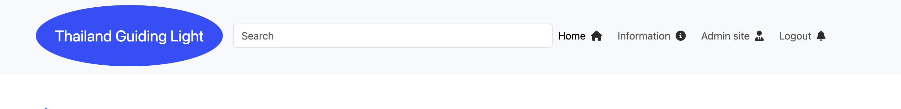
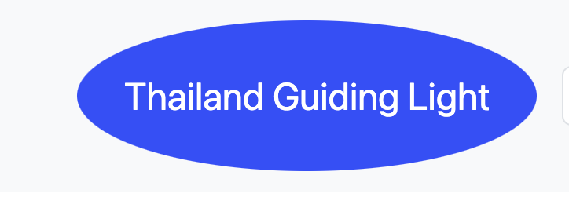

# Feature
## Access to pages according to the user role:
write mark down table

## Main Features:
  - Each page has a navbar 

  Navbar: 
  
- The navbar has two subsection:
     1. User's section, which is visible is visible for all users:
        - if the user is admin 
        
        - if the user is not admin
        

     2. Logo, which redirect to the hame page;
      
      - home button, which redirects the user to the store page
      - information button, which redirects the user to the external link website "tourismthailand.org/home
      - admin site button, which redirects admin to django admin dashboard.
      - sign out, which redirects the user to logout 
      3. nav section 
      - you account, which redirect user to user account form and manage the user account
      
| Page Name | Most Popular Page | Logged In | logged Out | Addmin site | 
| --------- | ----------------- | --------- | ---------- | ----------- |
| Home      | Yes               | Yes       | Yes        | Yes         |
| Login     | Yes               | Yes       | Yes        | Yes         | 
| Sign up   | Yes               | Yes       | Yes        | Yes         |   
| Most popular placce      | Yes               | Yes       | Yes        | Yes         | 
| Information      | Yes               | Yes       | Yes        | No         | 
| Your Account      | Yes               | Yes       | Yes        | No         | 
| Chat      | Yes               | Yes       | Yes        | Yes         | 
| Travel Agent     | Yes               | Yes       | Yes        | Yes         | 
| Accommodations      | Yes               | Yes       | Yes        | Yes         | 
| Transport     | Yes               | Yes       | Yes        | Yes         |
| Thai Travel News     | Yes               | Yes       | Yes        | Yes         | 
     |  