# Main Features:
  - Each page has a navbar in the header and left section.

  ## Navbar 
  ### Header navbar:
  **Access to pages according to the user role**
  - The Navbar has two subsections :
1. User's section, which is visible to all users :
  - Logo, which redirects to the home page
     
  

  - Header nav bar
  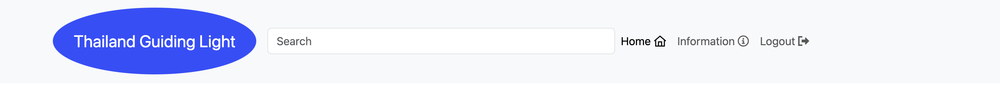

    - Home button, which redirects the user to the home page
    - The information button redirects the user to the Thailand tourism information website.
    - Logout button, which redirects the user to the logout
    - Access to page table

  | User Name | Sign in | Sign up | Comment |
  | ------- | --------- | ------- | ------- |
  | New user | Yes | Yes | Yes | - |
  | User | Yes | Yes | Yes | - |

2. Admin's section, which is visible for all admin:
    if the user is an admin 

   

    - Access to page table

  | User Name | Home | Information | Admin site | Logout | Comment |
  | --------- | ---- | ----------- | ---------- | ------ | ------- |
  | Admin | Yes | Yes | Yes | Yes | - |
  | New User | Yes | Yes | No | Yes | - |
  | User | Yes | Yes | No | Yes | - |

 
  ### Left navbar section:
  - Your Account button, which redirects the user to Your account page.
  - Your Connection button, which redirects the user to the connection page(Future Improvement).
  - Chat button, which redirects the user to the popover chat box(Future improvement).
  - Most Popular place button, which redirects the user to the most popular page.
  - Travel Agent, which redirects the user to the travel agent's external link.
  - Accommodations button, which redirects the user to the accommodation website page.
  - Transport button, which redirects the user to the transport booking website.
  - Thai Travel News, which redirects the user to the external link Thai Travel News.

**The simplistic design of the Navbar is based on the decision to make the use of the web app easy for all users.**

  - 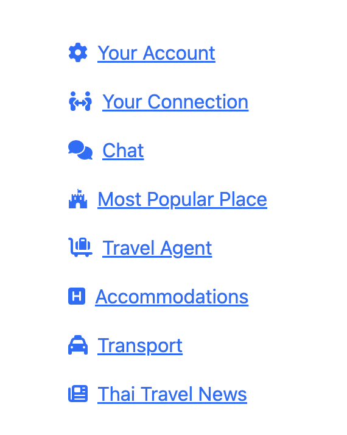

    - Access to page table
      
| Page Name | Your Account | Most Popular Page| Your Connection | Chat | Most Popular | Travel Agent | Accommodations | Transport | Thai Travel News | Comment |
| --------- | ----------------- | ------------ | --------------- | ---- | ------------ | ------------ | -------------- | --------- | ---------------- | ------- |
| Admin      | Yes               | Yes       | Dummy link       | Dummy link   | Yes | Yes | Yes | Yes | Yes |  Future improvement  |
| New User      | Yes               | Yes       |         | Dummy link   | Yes | Yes | Yes | Yes | Yes |  Future improvement |
| User      | Yes               | Yes       |         | Dummy link   | Yes | Yes | Yes | Yes | Yes |  Future improvement |

## Home page :

  ### Laptop home page has 
  - header navbar
  **header section has a logo in the top left corner. There is also an eye-catching image**
  

  - Left navbar section
  **The left section nav has a list of nav link buttons that are nice and clear with an icon on the front, which will navigate the user directly to what they need to do and connect.**
  
  - The left section nav has a list of nav link buttons that are nice and clear with an icon on the front, which will navigate the user directly to what they need to do and connect. 

  - Left section advert

  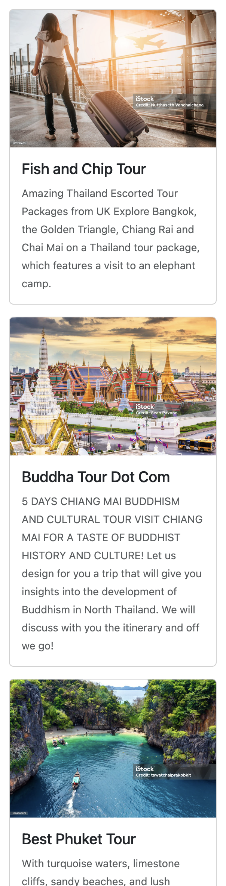

  - Create a post section

  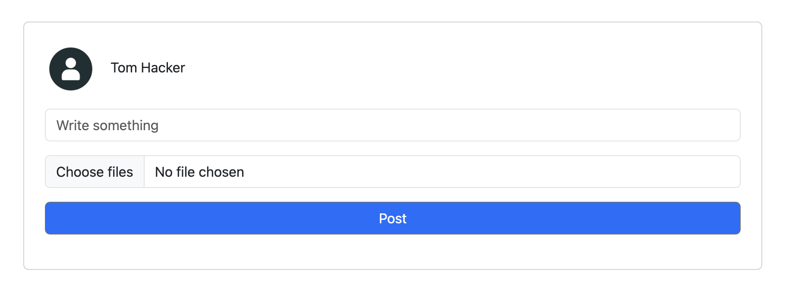

  - Create a post section that has a simple form to fill and a small default image to show if the user has not managed to load, and it has a big and bright submit post button.

  - Display post section

  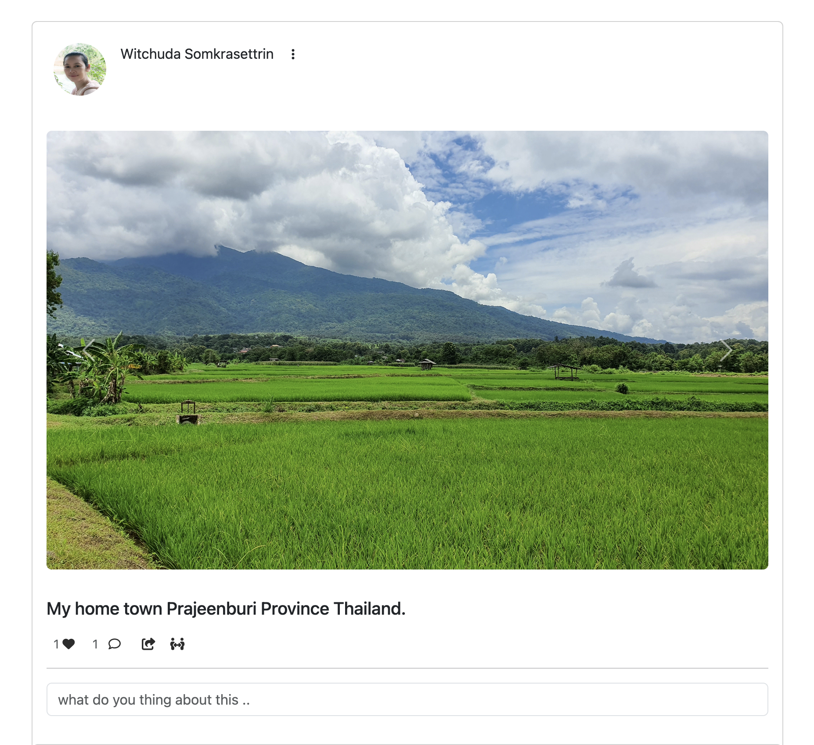

  - The display post section has a user image in a circle shape, and the name on the same line underneath has a carousel to display multiple images.
  
### Mobile home page
  **The mobile home page has a hamburger dropdown. It will show a navbar when you click on the hamburger icon and in the dropdown menu, you will have an admin site nav to navigate to the Django panel for admin**
  - mobile home page for new user
  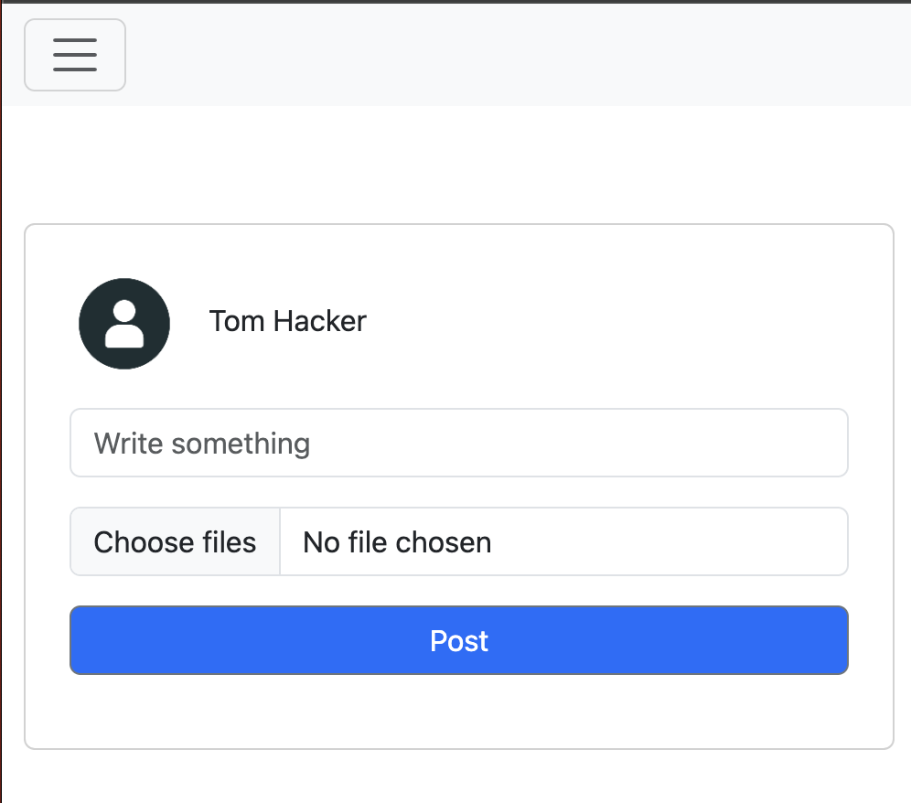
  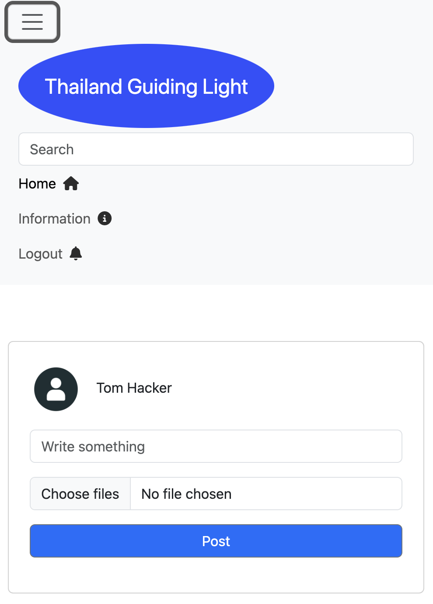

  - mobile home page for user
  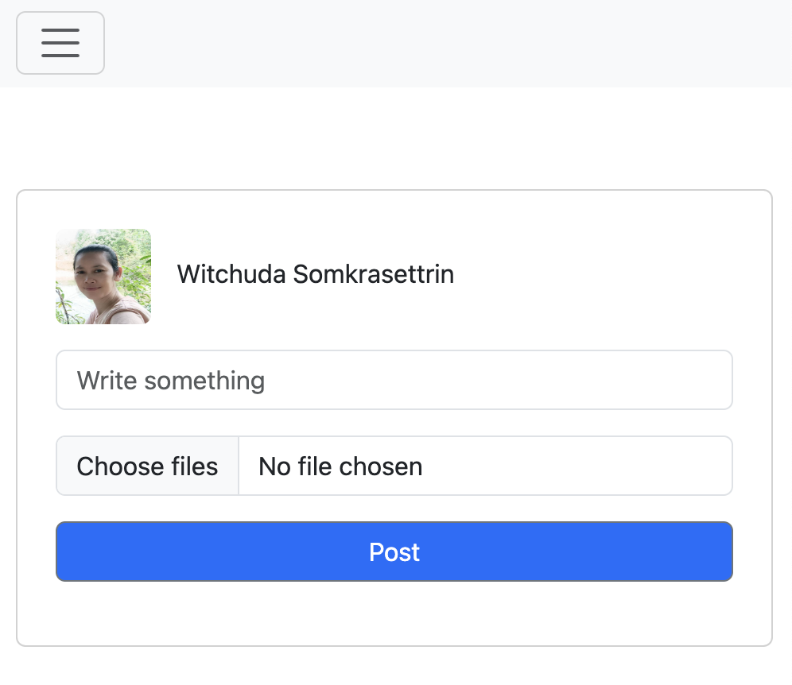
  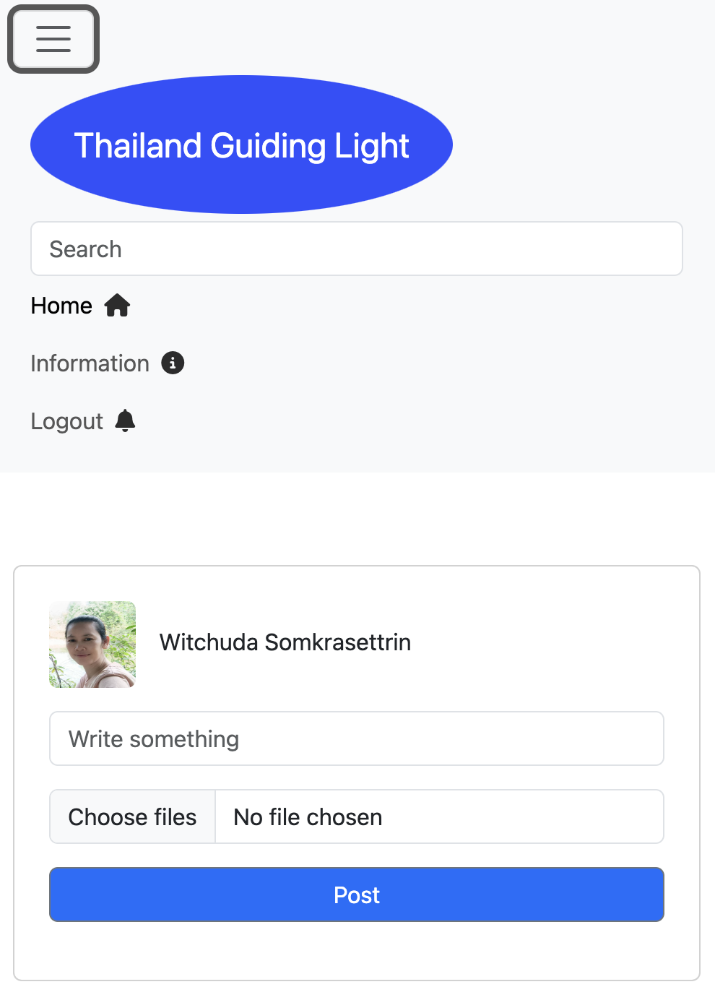

  - Mobile home page for admin
  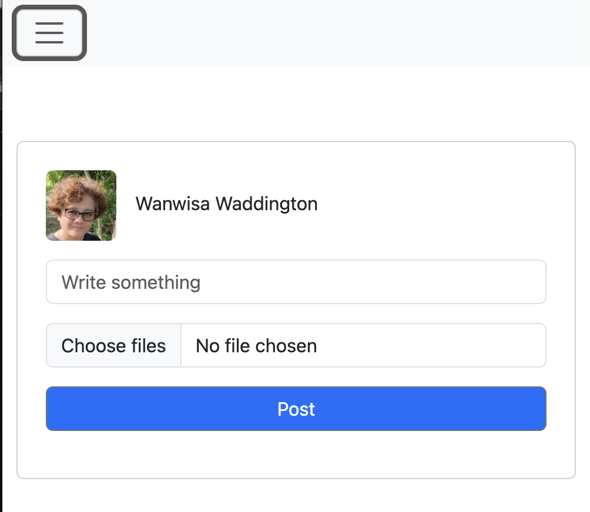
  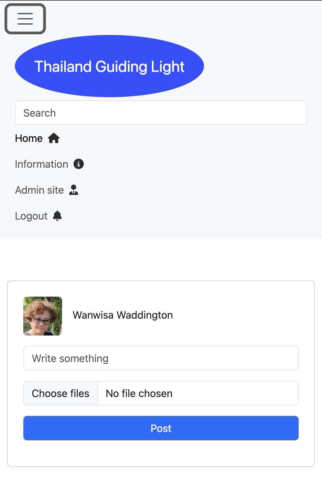

 ## Your account page
  - This page has the primary data; this page allows the user to add or edit profile image, account name, full name, email address, phone number 
    - It has an avatar as a default if the user don't want to display their image
      - Your account's new user
      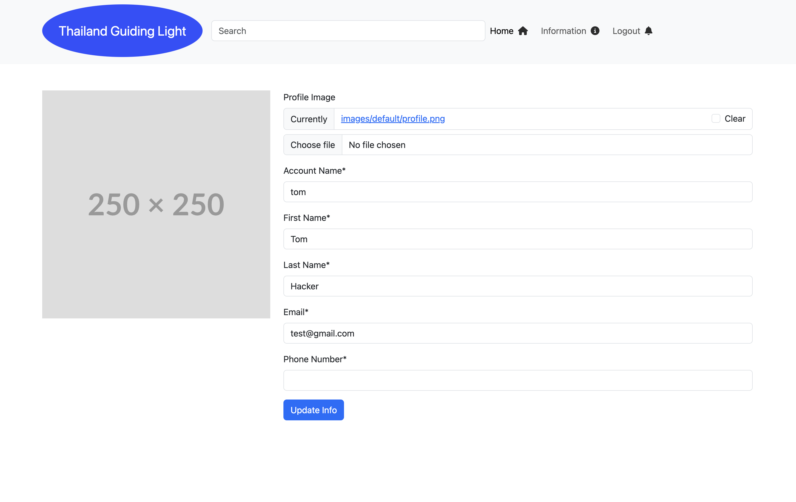

      - your account user
      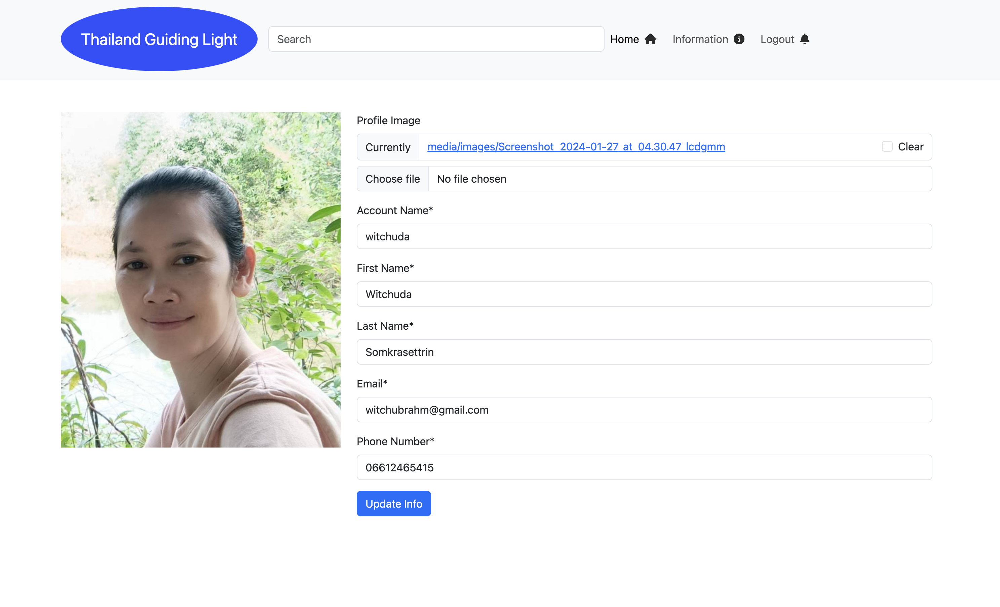

      - your account admin
      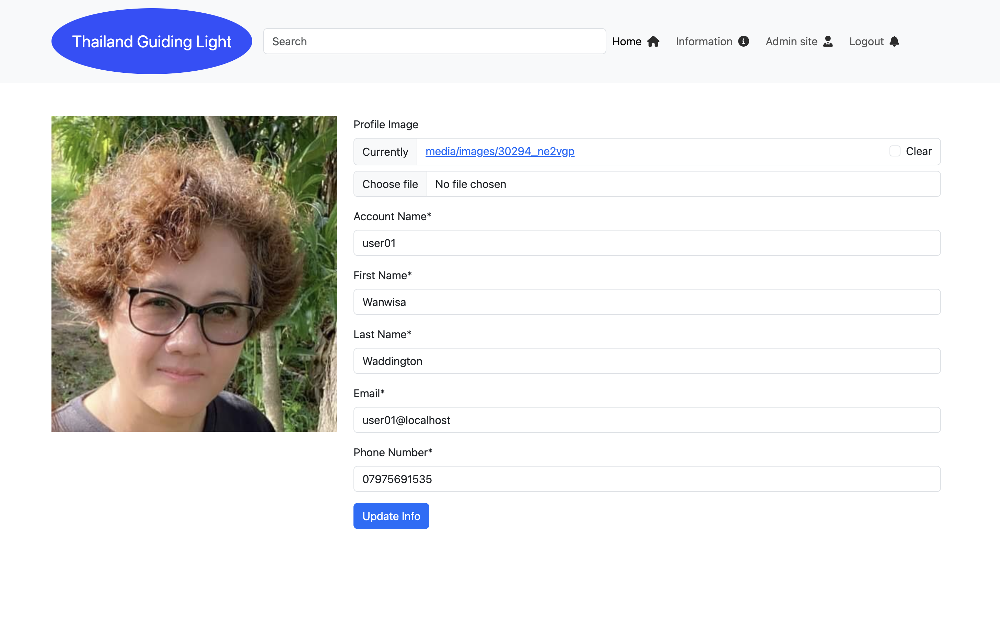
### Your account page mobile
 - This page has a hamburger dropdown including four navigate nav links and the primary data in this page allows the user to add or edit profile image, account name, full name, email address, phone number 
    - It has an avatar as a default if the use doesn't want to display their image
      - Your account's new user
      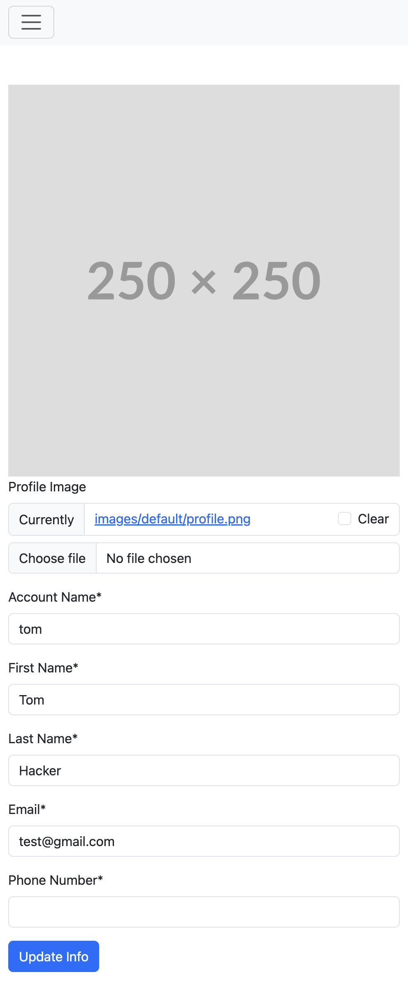

      - your account user
      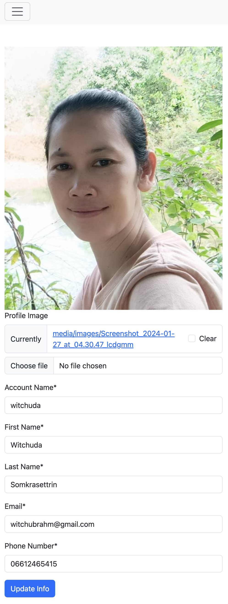

      - your account admin
      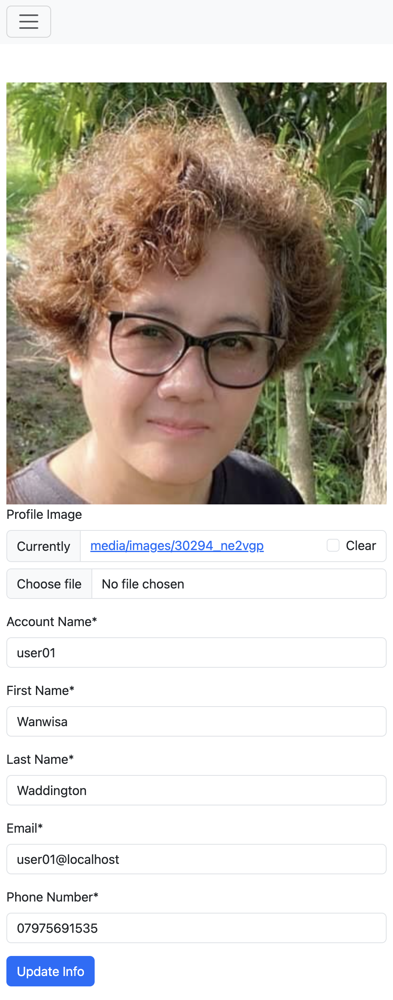

## Most popular place
  - This page has the most popular places in Thailand that will always be on the top list to visit.
      - most popular page for users and new users
  

       - most popular page for admin
  

  ### Most popular place mobile
   - This page has the most popular place in Thailand that will always in the top list for tourists to visit, and a hamburger dropdown to hide/show the nav link
    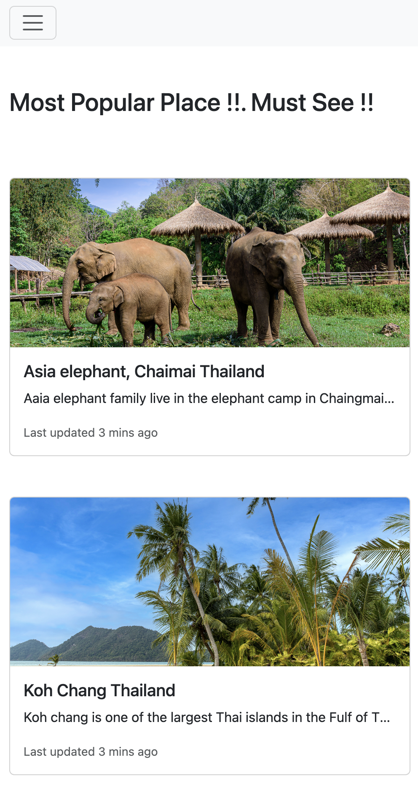

    

## Allauth and Access pages :

  - Logout page
  

  - login page
  
  
  - sign up page
  

