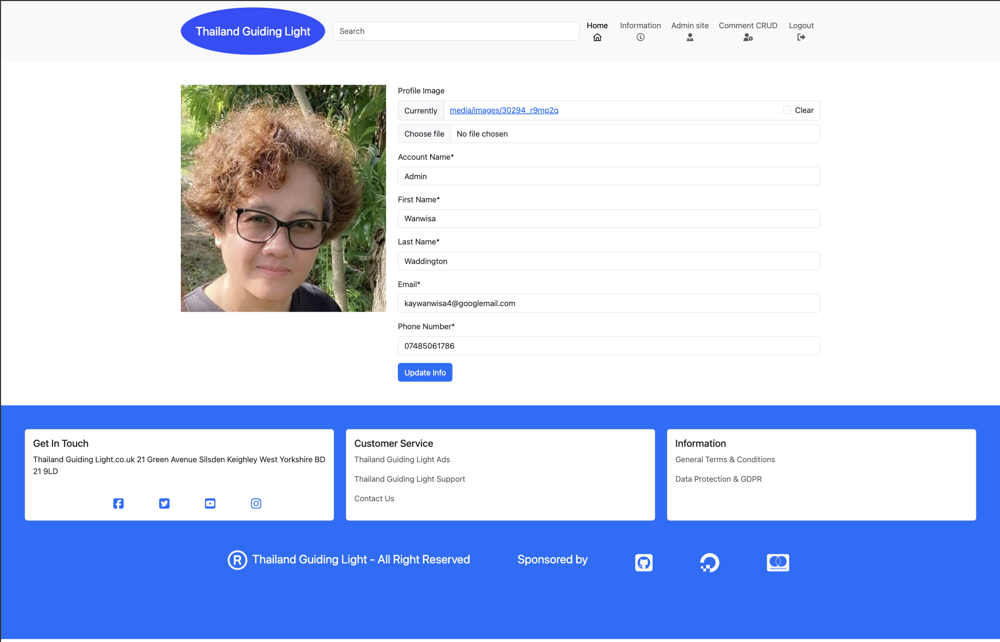

# Feature
## Access to pages according to the user role:
write mark down table

## Main Features:
  - Each page has a navbar 

  Navbar: 
  
- The navbar has two subsection:
     1. User's section, which is visible is visible for all users:
        - if the user is admin 
        
        - if the user is not admin
        

     2. Logo, which redirect to the hame page;
      
      - home button, which redirects the user to the store page
      - information button, which redirects the user to the external link website "tourismthailand.org/home
      - admin site button, which redirects admin to django admin dashboard.
      - sign out, which redirects the user to logout 
      3. nav section 
      - you account, which redirect user to user account form and manage the user account
      
| Page Name | Most Popular Page | Logged In | logged Out | Addmin site | 
| --------- | ----------------- | --------- | ---------- | ----------- |
| Home      | Yes               | Yes       | Yes        | Yes (Only for admin)       |
| Login     | No              | No       | No        | No         | 
| Sign up   | No               | No       | No        | No         |   
| Most popular place      | Yes               | Yes       | Yes        | Yes         | 
| Your Account      | Yes               | Yes       | Yes        | No (Only for admin)        | 

## Mainm Featrues :
  - Each page has a navbar in header and left section.
  ### Navbar : 
  - The navbar has two subsections :
     1. User's section, which is visible for all users :
       **if the user is logged in, the Navbar has the following feature :**
         - [User navbar in header](documentation/user-navbar-in-header.png)
            - Logo, which redirects to the home page
            - Home button, which redirects the user to the home page
            - Information button, which redirects the user to the tourismthailand information website.
            - logout button, which redirects the user to the logout
            - logout form, which redirects the user the login form and signup link to redirect to the signup form.
       

      2. Admin's section, which is only visible for admin :
       
            will have the same navbar like user but admin site button will appear
            - Admin Site button, which redirects to django admin page. 

      3. Left Navbar section 
        - 
          - Your Account button, which redirects the user to the your accont page
          - Your Connection button, which redirects the user to the connection page
          - Chat button, which redirects the user to the popover chat box
          - Most Popular place button, which redirects the user to the most popular page
          - Accommodations button, which redirects the user to the accommodation website page
          - Transport button, which redirects the user to the transport booing website
**The simplistic design of the Navbar is based on the decision to make the use of the web app easy for all users.

**Navbar looks as follows on the mobile debices**

## Home page :

  ### Laptop home page has 
   - header havbar
  
  header section has a logo in the top left cornor. There is also an eye-catching image 

   - Left section navbar
  
     - left section nav has a list of nav link button nice and clear with an icon on front which will navigate the user direct to what they need to do and connect. 
   - Left section advert
  

   - Create post section
  
     - Create post section has simple form to fill and small default image show if user have not manage to load their image, also big and bright submit post button.

   - Display post section
  
     - Display post section has user image in a curcle shape and name on the same line underneath has a carousal to display multiple image.
  
### Mobile home page
  - Mobile home page has hamburger dropdown it will show navbar when you click on hamberger icon and in the dropdown menu will have admin site nav to navigate to Django panel for admin 
    - mobile home page for new user
  
  

    - mobile home page for user
  
  

    - Mobile home page for admin
  
  

 ## Your account page
  - This page has the primary data, this page allows the user to add or edit profile image, account name, full name, email address, phone number 
    - It has an avatar as a default if the use don't want to display their image
      - Your account new user
      
      - your account user
      
      - your account admin
      
### your account page mobile
 - This page has hamburger dropdown include four navigate nav link and the primary data in this page allows the user to add or edit profile image, account name, full name, email address, phone number 
    - It has an avatar as a default if the use don't want to display their image
      - Your account new user
      
      - your account user
      
      - your account admin
      

## Most popular place
  - This page has the most popular place in Thailand that will alway in a top list to visit.
      - most populay page for user and new user
  
       - most populay page for admin
  

  ### Most popular place mobile
   - This page has the most popular place in Thailand that will alway in a top list for tourish to visit, and hamburger dropdown to hide/show nav link
    
    

    ## Allauth and Access pages :

  - Logout page
  

  - login page
  
  - sign up page
  

