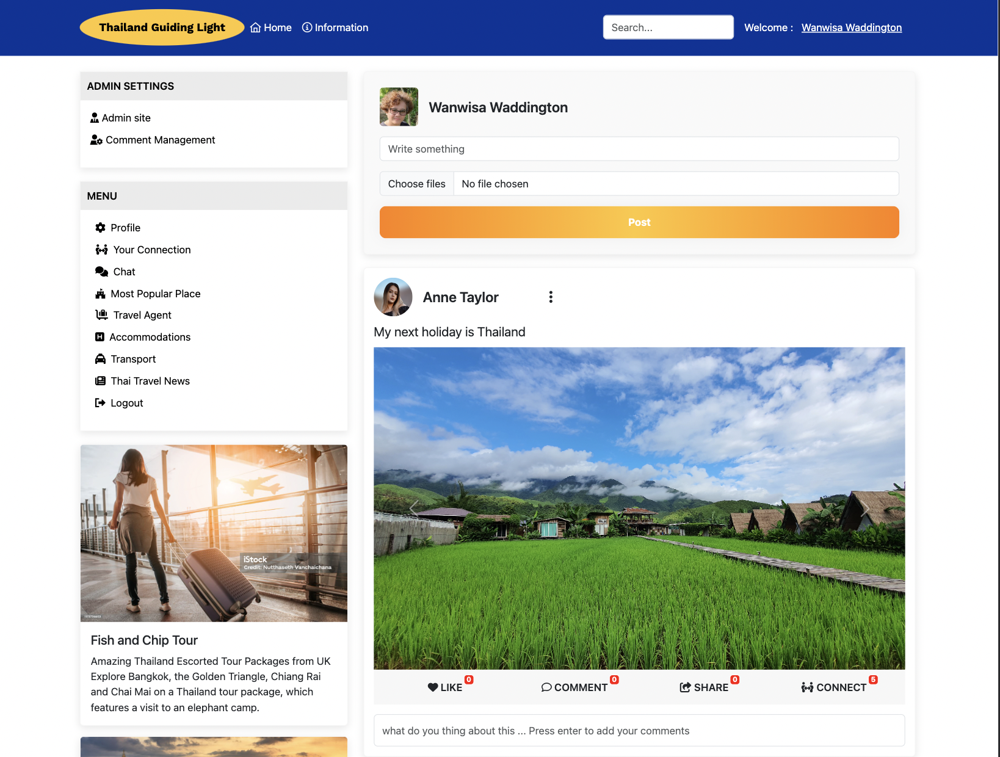
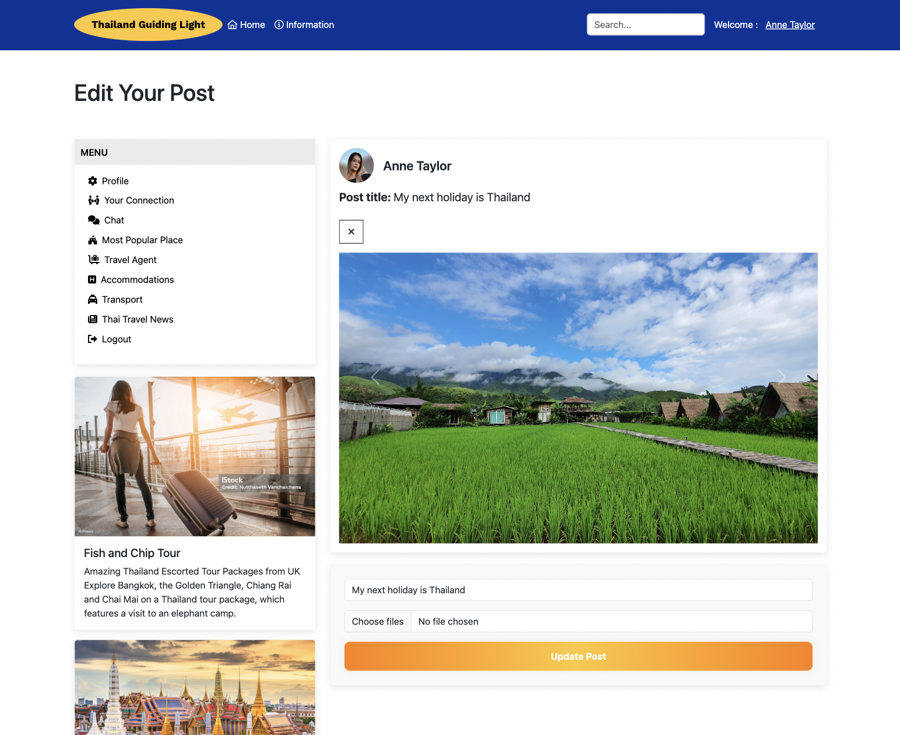

# Main Features:
  - Each page has a navbar in the header and left section.
## Home page :
- Admin Home Page

- User Home Page

- New User Home Page

  ## Navbar 
  ### Header navbar:
  **Access to pages according to the user role**
  - The Navbar has two subsections :
1. User's section, which is visible to all users :
  - Logo, which redirects to the home page
     
  

  - Header nav bar for user and admin
  

    - Home button: which redirects the user to the home page
    - The information button: redirects the user to the Thailand tourism information website.
    - Search Bar: This interface element is designed to help users quickly and efficiently find specific information or items. It enhances the user experience by enabling easy access to relevant content (planned for future enhancement).
    - Welcome Message & Username Display: Displays a welcome message and the user's name to confirm that they are on their account page, enhancing the user experience.

  ### Left navbar section:
 
  **The left section nav has a list of nav link buttons that are nice and clear with an icon on the front, which will navigate the user directly to what they need to do and connect.**

**The navbar's simplistic design is intentionally crafted to ensure ease of use for all users of the web app.**

### Admin's Left Navbar: This section is visible to all users identified as admins. This section includes two navigation links.

- Admin Site Navigation Link: Directs to the admin panel, allowing for the creation, reading, updating, and deletion (CRUD) of information from both admin and user accounts.

- Comment Management Navigation Link: Directs to the admin comment management page, where admins can efficiently create, read, update, and delete comments using a user-friendly interface.

  - The comment management page has a notifications function.

   - The comment management page has an All comments detail table make it easy to manage.

**Access to page table**

| Welcone:User Name | Admin Site | Comment Management |
  | ------- | --------- | ------- |
  | Admin | Yes | Yes | Yes |
  | New user | No | No | No | 
  | User | Yes | No| No| 

  ### User's Left navbar section:

   

  - Profile Account Button: Redirects users to their account page, where new users can upload their image and enter personal information. Existing users can update their image and information as needed.

  

  - Your Connection Button: Redirects users to the Connections page, where the account owner can accept or cancel connection requests, or disconnect from existing connections.

  

  - Chat button, which redirects the user to the popover chat box(Future improvement).
  - Most Popular Places Button: Redirects users to the Most Popular Places page. Here, users can click links to connect with travel agents who support the website. Enhancements to this feature are planned for future improvement.

   
   

  - Travel Agent, which redirects the user to the travel agent's external link.
  - Accommodations button, which redirects the user to the accommodation website page.
  - Transport button, which redirects the user to the transport booking website.
  - Thai Travel News, which redirects the user to the external link Thai Travel News.
  - Logout button, which redirects the user to logout/signup page.
  
    - when the user click sign out which redirects the user to the sing in and sign up page.
  

    **Access to page table**

  | user | Welcome:User Name | Home | Information | Admin site | Comment Management | Profile | Your Connection | Chat | Most Popular Place | Travel Agent | Accommodations | Transport | Thai Travel News | Logout |
  | --------- | ---- | ------- | ----- | ------ | ------- | -------- | ------- | ------ | ----- | ----- | ---- | ---- | ------ | -----|
  | Admin | Yes | Yes | Yes | Yes | Yes | Yes | Yes | Yes | Yes | Yes | Yes | Yes | Yes | Yes |
  | New User | No | Yes | Yes | No | No | Yes | Yes | Yes | Yes | Yes | Yes | Yes | Yes | Yes | 
  | User | Yes | Yes | Yes | No | No | Yes | Yes | Yes | Yes | Yes | Yes | Yes | Yes | Yes |

## Main Section: 
Comprises the Account Owner's Post Creation Section and the Post Display Section.

  - Account Owner's Post Creation Section: includes a profile image of the account owner, an input field for entering the post header, and a 'Choose File' option for uploading images or files. Below these, there is a 'Post' button that submits the content to the Post Display Section.

  

- Display post section: Features a circular user image alongside the user's name and a three-dot vertical icon at the top. Below, a carousel displays multiple images. Underneath the carousel, there are four icons: a heart, a comment bubble, a share symbol, and a connect icon. Users can interact with the post by clicking the heart to express liking the post, the comment bubble to leave their thoughts, the share symbol to copy the post link, and the connect icon to link up with the post owner.

  

    - Three Dots Vertical Icon: Features a hover function that displays a navigation menu, allowing the post owner to easily edit or delete their posts.

     

    
    - Delete Post: This option allows the post owner to delete a post. Upon selecting 'Delete', a confirmation popup appears. If the user clicks 'Yes, Proceed', an alert confirming successful deletion will display. After clicking 'OK' on the alert, the user will be redirected to the homepage where the post was originally displayed.

    

    - an alert confirming successful image .
    

     - Edit Post: Redirects the user to the edit post page, where the post owner can delete individual or multiple images, add new images, and edit the header to update the post.

       

    #### Heart icon, comment icon, share icon, connect icon, input field
    - Heart Icon: Clicking this icon toggles a 'like' for the post, increasing or decreasing the like count on its badge accordingly.
    - Comment Icon: Opens the comment section under the post. Users can view all comments made by others.
    - Share Icon: Allows users to share the post by copying its URL link.
    - Connect Icon: Sends a connection request to the post owner when clicked. If the post owner accepts, the connection count increases; if declined, there is no change.
    - Input Field: Users can type their comments here and press enter to post. Each new comment will update the comment count accordingly.

    

  
   #### Advert left section
   - Advertising Display: Advertisements paid for by clients will be displayed and managed by the website administrator. Currently, there are no special features; future enhancements are planned to expand functionality.

    

     #### Footer
    - Footer Layout: The footer is divided into three sections: 'Get in Touch', 'Customer Service', and 'Information'. Each section contains links to relevant pages. Enhancements to these links are planned for future improvement.

    

### Mobile home page
  **The mobile home page has a hamburger dropdown. It will show a navbar when you click on the hamburger icon and in the dropdown menu, you will have an admin site nav to navigate to the Django panel for admin**
  - mobile home page for new user
  
  

  - mobile home page for user
  
  

  - Mobile home page for admin
  
  

  - Comment CRUD page
  
  

 ## Your account page
  - This page has the primary data; this page allows the user to add or edit profile image, account name, full name, email address, phone number 
    - It has an avatar as a default if the user don't want to display their image
      - Your account's new user
      

      - your account user
      

      - your account admin
      
### Your account page mobile
 - This page has a hamburger dropdown including four navigate nav links and the primary data in this page allows the user to add or edit profile image, account name, full name, email address, phone number 
    - It has an avatar as a default if the use doesn't want to display their image
      - Your account's new user
      

      - your account user
      

      - your account admin
      

## Most popular place
  - This page has the most popular places in Thailand that will always be on the top list to visit.
      - most popular page for users and new users
  

       - most popular page for admin
  

  ### Most popular place mobile
   - This page has the most popular place in Thailand that will always in the top list for tourists to visit, and a hamburger dropdown to hide/show the nav link
    

    

## Allauth and Access pages :

  - Logout page
  
  

  - login page
  

  - sign up page
  

