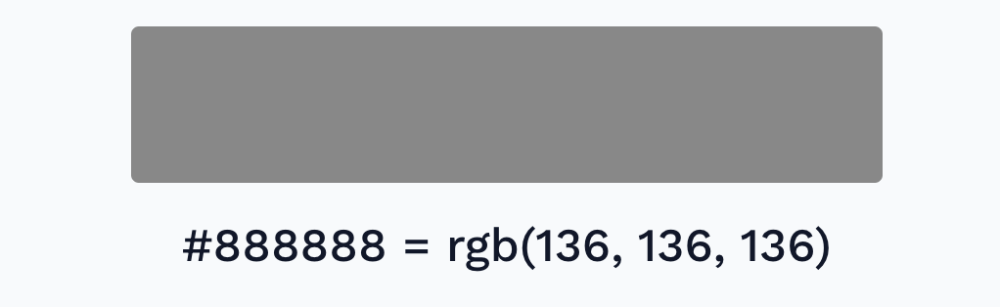
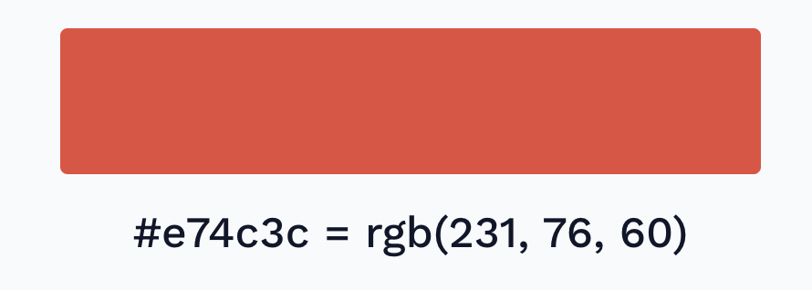
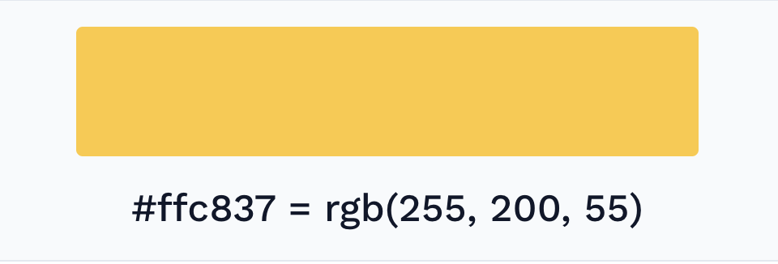
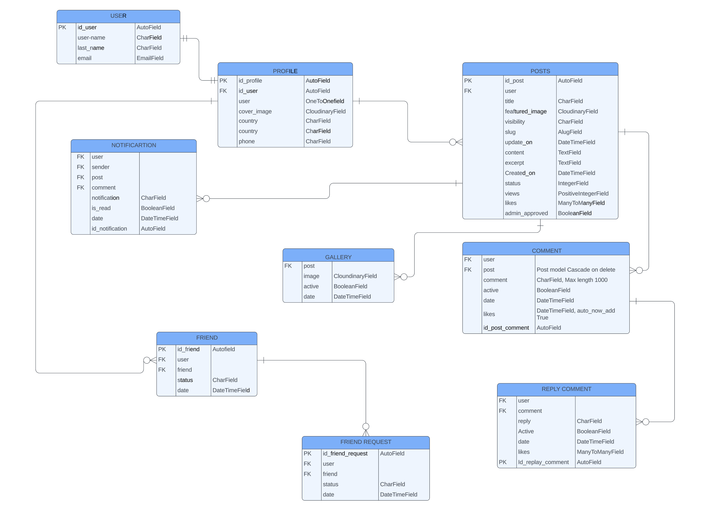
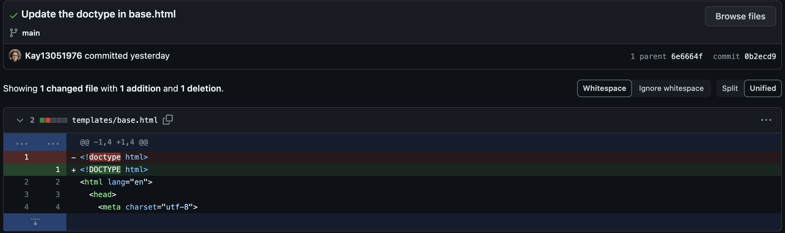
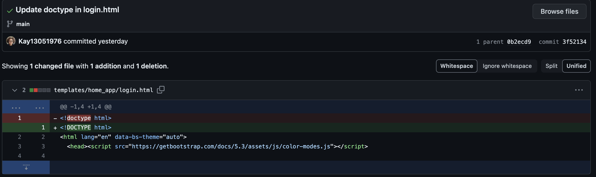

# Thailand Guiding Light
  - Deployed website:[Link to website](https://thailand-guiding-light-2fb0b0e33db8.herokuapp.com/)

  ## About
  Thailand Guiding Light is a dynamic social networking site designed for enthusiasts of Thailand travel. Whether residing in or visiting Thailand, users can share their experiences through photos, videos, and posts, engage with content via likes and comments, and explore external links to other social sites or websites. The platform serves as a marketplace to promote and sell travel packages, boosting visibility for local tour businesses and other tourist-related services. Additionally, users can network with like-minded individuals globally or locally, enhancing communication and building relationships.

The site supports eCommerce by allowing businesses to advertise and direct users to their websites. It features a comprehensive login system and personal account management tools that enable both users and administrators to edit and manage their profiles effectively.

Deployed Website: Visit Thailand Guiding Light[ Link to website](https://thailand-guiding-light-2fb0b0e33db8.herokuapp.com/)
## UX  
  The website was created to be eye-catching and user-friendly. The user is given a simple procedure when they want to share their experience picture and videos. The emphasis is on the user experience. The user can navigate the website easily to fulfil the user's goal; the website is designed to be ready to use and easy to understand.

## Target Audience
  A Thailand Guiding Light's target audience is people who want to share Their passion for travel and living in Thailand. This group will have specific shared characteristics that connect them and make them relevant to their friends, relatives, customers and colleagues. You can find people who share their same interests online and sell Tourist relevant 
  product or tour package online, and promote brands and Thailand tour businesses.
## User Stories ## 
 ### As a first time user ###
- Admin
  - As an admin, I need the ability to adjust user account settings, suspend accounts, or delete them as required.
  - As an admin, I require a user-friendly interface on my admin homepage that allows for easy management of comments.
  - As an admin, I require access to detailed analytics on user engagement, content popularity, and overall platform performance to guide decision-making and enhance the user experience.
  - As an admin, I need to receive automated notifications for critical events, including system outages, policy violations, or user-reported emergencies, to ensure prompt response and management.
  - As an admin, I want the capability to monitor and review all   
  user-generated data such as posts, comments, likes, and shares for compliance and quality control.
- First time user 
  - As a First Time Visitor, I want to quickly understand the app's primary purpose so that I can learn more about how to get benefit from this app.
  - As a First Time Visitor, I want to navigate through the app to find the content easily.
  - As a First Time Visitor, I want to find this useful for my needs.
  - As a First Time Visitor, I want to be able to easily to create an account by providing basic information such as my name, email address , and password.
  - As a First Time Visitor, I want to be informed if I am making any errors when create my account so that I can fix any mistakes quickly.
  - As a Firs Time Visitor, I want to have a personalized profile where I can add a profile picture, cover photo, and write a bio to introduce themself to others.
  - As a First Time Visitor, I want to see the variety of places in Thailand, such as images, VDO, and short stories that are most valuable to visit.
  - As a First Time Visitor, I want to share my photo, videos, and comment on a beautiful place in Thailand.
  - As a First Time Visitor, I want to quickly and easily connect to people and link them to book the holiday trip (Hotel, Flight, Taxi, Guide, and All facilities).
  - As a First Time Visitor, I want to be able to access social media websites from various devices, such as desktop computers and smartphones, with a consistent user experience.

- Regular User
  - As a Regular User, I want to access my account without having to log in every time so that I can quickly post and share pictures, videos, and short stories.
  - As a Regular User, I want to safely protect my account details from sharing pictures, videos and short stories.
  - As a Regular User, I want to view my data to quickly check my account details and add or amend the information.
  - As a Regular User, I want to be able to search for a connection with a friend, a place or a relative story by name, username, or email address to get the most appropriate choices so that I am likely to find what I am looking for.
  - As a Regular User, I want to send, delete and updates post, photos, external content and videos to share with my connector.
  - As a Regular User, I want to be able to search for people, places, and relevant organizations by text search so that I can connect to communicate with them.
  - As a Regular User, I want to see ratings and reviews on a photo or videos, the story of the place that the experience shares.
  - As a regular User, I want to customize my news post and have control over the privacy of my posts, being able to choose who can see them.
  - As a regular User, I want to be notified when someone interacts with my posts or sends me a message, so I can stay engaged and respond promptly.
  - As a regular User, I want to be able to report or block other users for inappropriate behavior, ensuring a safe and respectful community,

## Wire frames
 ### Laptop and tablet
- Home page

- Most popular place page

- Your connection

- Profile page

 ### Mobile

- Mobile home page
 

- Mobile home page hamburger menu drop down
 

- Mobile admin popover nav menu

- Mobile user popover nav menu

- Mobile your connections page

- Mobile comment management page

- Mobile most popular place

## Workflow

 

 ## Future Development
- Chatbot: to communicate and information retrieval, Entertainment, Language learning, Customer support and Task Automation.
 - Group : joined or create group based on interests, hobbies, or affiliation to connect with like-minded people and discuss topics.
 - Page : similar to profiles but for business, organizations, public figures, and brands. Users can like/follow pages to receive updates.
 - Notifications : alert you to activity on your account, such as friend requests, comments, likes, and event invitations.
 - Privacy setting : control who can see you posts, friend list, profile information, and other personal data.
 - Ads : advertising platform allows business to create and target ads to specific demographics, interests, and behaviors.
 
## Technologies used
 
### Languages
 - [Python 3.9.17](https://www.python.org/downloads/release/python-3917/): python framework used to create all the logic.
 - [JS](https://www.javascript.com/): the primary language used to  develop interactive components of the website.
 - [HTML](https://developer.mozilla.org/en-US/docs/Web/HTML): the markup language used to create the website.
 - [CSS](https://developer.mozilla.org/en-US/docs/Web/css): the styling language used to style the website.

 ### Frameworks and libraries:
 - [Django](https://www.djangoproject.com/): Django use to build content management systems.
 - [jQuery](https://jquery.com/): was used to control-click events and sending AJAX requests.
 - [jQuery User Interface](https://jqueryui.com/):was used to create interactive elements.
 - [Bootstrap](https://getbootstrap.com/docs/5.0/forms/form-control/): was used to create templates html file
    
 ### Database:
 - [SQLite](https://www.sqlite.org/index.html):was used to as a development database.
 - [PostgreSQL](https://www.postgresql.org/):the database used to store all the data.
 ### Other tools:
 - [Git](https://git-scm.com/): The version control system used to manage the code.
 - [Pip3](https://pypi.org/project/pip/): the package manager used to install the dependencies.
 - [Gunicorn](https://gunicorn.org/): the web server used to run the website.
 - [Psycopg2](https://www.psycopg.org/): the database driver used to connect to the database.
 - [Django-allauth](https://docs.allauth.org/en/latest/): the authentication library used to create the user accounts.
 - [Render](https://pypi.org/project/render/): was used to render the README file.
 - [GitHub](https://github.com/): used to host the website's source code.
 - [GitPod](https://www.gitpod.io/): the IDE used to develop the website.
 - [Cloudinary](https://cloudinary.com/): was used to store all the images for the website.
 - [Chrome Devtools](https://developer.chrome.com/docs/devtools/open/): was used to debug the website.
 - [Font Awesome](https://fontawesome.com/icons): was used to create the icons used in the website.
 - [Lucidchart](https://www.lucidchart.com/pages/): was used to make a flowchart for the README file.
 - [Colors](https://coolors.co/): was used to make a colour palette for the website.
 - [W3C Validator](https://validator.w3.org/):was used to validate HTML5 code for the website.
 - [W3C CSS validator](https://jigsaw.w3.org/css-validator/): was used to validate CSS code for the website.
 - [JShint](): was used to validate JS code for the website.
 - [PEP8](https://pep8.org/): was used to validate Python code for the website.
 - [Privacy Policy Generator](https://www.privacypolicygenerator.info/): was used to create the privacy policy.
 - [Django-extensions](https://django-extensions.readthedocs.io/en/latest/): was used to create an Entity-Relationship Diagram.
 - [iStock by Getty Images](https://www.istockphoto.com/): was used to get background images and all the images for the website.
 - [Code institute CI python linter ](https://pep8ci.herokuapp.com/): was use to validate the python code for the website.

 ## Features
 Please refer to the [FEATURES.md](FEATURE.md)file for all test-related documentation.
 ## Design
 ### Color Scheme
- Adver hover colour

- icon hover colour
 
- Logo background color

- Post button and submit button color: linear-gradient(to left, #FF8008 0%, #FFC837  51%, #FF8008  100%);
- 
- Header and footer background color
 
- Header content colour and paragraph colour

- Body backgruon colour and conten colour

- Post function background color

- Sub header content colour

- Count badge colour

- Link paragraph colour

- Paragraph colour

**color convertor use to pick color** 
  - [Color convertor](https://cssgenerator.org/rgba-and-hex-color-generator.html): was use to conver the css color code.
  - [Gradientbuttons colorion tool](https://gradientbuttons.colorion.co/): was use to pick the button background colour.
  - [Colorcodefinder.com](https://colorcodefinder.com/hex-to-rgb?input=%230d6efd): was use to conver css color code.

 ### Typography
 The main font used in the application is Roboto, a bootstrap default. Roboto is straightforward and has perfect readability, is comfortable and frictionless, increase user experience
**Bootstrap utilizes a "native font stack" or "system font stack"**
- 

- 
- 

## Agile Methodology
### GitHub project management
**GitHub project management was used to manage the project. It help me to prioritize the task and to keep track of me progress.**
- 
- 
- 
- 
- 

## Login Sign-up Flowcharts
- 

## Information Architecture

### Database
- The Thailand Guiding Light website database was migrated to PostgreSQL.

**Entity-Relationship Diagram**

### Data Modeling

## Testing
- Please refer to the [TESTING.md](TESTING.md) file for all test-related documentation.

## Deployment 
- The app was successfully deployed to[Heroku](https://id.heroku.com/login)

- The database was deployed to [ElephantSQL](https://www.elephantsql.com/)
- The app can be reached by the [link](https://thailand-guiding-light-2fb0b0e33db8.herokuapp.com/)

**Please refer to the [DEPLOYMENT.md](DEPLOYMENT.md) for all deployment**
## Credits
- [GitHub](https://github.com/)for giving an idea of the project's design.
- [Django](https://www.djangoproject.com/) for the framework.
- [Font awesome](https://fontawesome.com/)for the access icons.
- [jQuery](https://jquery.com/)for providing a variety of tools to make standard HTML code look appealing.
- [PostgresSQL](https://www.postgresql.org/) for providing a free database.
- [Very Academy Youtube Channel](https://www.youtube.com/) for brilliant tutorials, which shed light on the implementation of databases with multi-value products, precise explanations of Django, social media websites, API, and many other things.
- [Responsive Viewer](https://chromewebstore.google.com/detail/responsive-viewer/inmopeiepgfljkpkidclfgbgbmfcennb) for providing a free full web page screenshorts.
- [Coolors](https://coolors.co/)for providing a free platform to generate your palette.

## Content and Images
**All the images for the website were taken from**
- [iStock by Getty Images](https://www.istockphoto.com/)
### image
  - [Chiangmai Thailand](https://www.istockphoto.com/photo/hot-air-balloons-gm619250406-107950677?phrase=chiangmai+thailand)
  - [Rachaburi Thailand](https://www.istockphoto.com/photo/market-woman-at-damnoen-saduak-in-thailand-gm535808385-57328202?phrase=bangkok+Thailand)
  - [Golden buddha in bangkok Thailand](https://www.istockphoto.com/photo/reclining-buddha-wat-pho-temple-bangkok-thailand-gm467571456-60438042?phrase=bangkok+Thailand)
  - [Kanchanaburi Thailand](https://www.istockphoto.com/photo/the-train-commute-through-the-famous-the-death-railway-in-kanchanaburi-thailand-gm1131397513-299569459?phrase=kanchanaburi+thailand)
  - [James Bond island near Phuket](https://www.istockphoto.com/photo/famous-james-bond-island-near-phuket-gm1044376524-279537477?phrase=phuket+thailand)
  - [Similan island Phuket](https://www.istockphoto.com/photo/similan-islands-phuket-thailand-views-gm1566579959-527586195?phrase=phuket+thailand)

  - [Surin beach in Phuket](https://www.istockphoto.com/photo/aerial-view-of-surin-beach-in-phuket-province-in-thailand-gm1365412456-436284501?phrase=phuket+thailand)
  - [Sino poetuguese Phuket](https://www.istockphoto.com/photo/phuket-old-town-with-old-clock-tower-buildings-in-sino-portuguese-style-restoration-gm1153025033-313024124?phrase=phuket+thailand)
  - [Koh Chang Thailand](https://www.istockphoto.com/photo/koh-chang-gm1659281885-534824316?phrase=Koh+chang+island+thailand)
  - [Wat Rong Khun Thailand](https://www.istockphoto.com/photo/wat-rong-khun-or-white-temple-landmark-chiang-rai-thailand-gm526443477-52763864?phrase=chiang+rai+thailand)
  - [Keren long neck woman Chaingrai Thailand](https://www.istockphoto.com/photo/karen-long-neck-woman-selling-handicrafts-in-hill-tribe-village-chiang-rai-thailand-gm1496955496-519473110?phrase=chiang+rai+thailand)
  - [Asia elephant family Chiangmai Thailand](https://www.istockphoto.com/photo/asia-elephant-family-live-in-the-elephant-camp-in-chiang-mai-gm1497301330-519714578?phrase=elephant+thailand)
  - [Luxury travel, romantic couple in beach hotel stock phot](https://www.istockphoto.com/photo/luxury-travel-romantic-couple-in-beach-hotel-gm1213840216-352931300)
  - [Karbi thailand](https://media.istockphoto.com/id/1309583872/photo/aerial-view-of-lao-lading-island-in-krabi-thailand.jpg?s=1024x1024&w=is&k=20&c=QluXaL4bsnRTTmpHZHvMRNJqGhFT-dBEy8xmJsXZWW8=)
  - [Temple in Bangkok Thailand](https://media.istockphoto.com/id/1146493663/photo/bangkok-thailand-at-the-temple-of-the-emerald-buddha-and-grand-palace.jpg?s=1024x1024&w=is&k=20&c=f2M_Pq_7ci7hp3sgSQfbhpZIrTfOSdlcocDXt2xvQXI=)
  - [Young women pulling suitcase](https://media.istockphoto.com/id/1173736603/photo/young-woman-pulling-suitcase-in-airport-terminal-copy-space.jpg?s=1024x1024&w=is&k=20&c=Z90V6j_KuXIgd8KW_7eObiQMFZTfO4lDnulJ1QmrDSg=)
  - [Tuktuk parking on front of temple](https://www.istockphoto.com/photo/tuk-tuk-thailand-thai-traditional-taxi-in-thailand-gm1131729452-299756253)

## Solved bug
- 
- 
## Unsolved bug
In the last deploy, the static file did not load in the Heroku which I ran out of time to sort this problem.
- 
## Mistake
- I have changed ERD and class in the models.py file many times because it is part of learning and caused me the problem of not being able to migrate the data. I could use the python manage.py shell and the same python I use in your views.py file to update the id value of each row in the database. I can also change them directly by using SQL on my database, wherever it's hosted, but I don't know SQL that well. So, I drop this choice
Or, like permanently, can delete/drop the database and start over. 
According to the limited time I had left before the PP4 submission deadline, I designed to rebuild everything from scratch; it caused me to lose all the git committed history when I tried to look back to see when the bug happened to sort out the Heroku dangerous site I am not able to find it because I assume the bug occurs when I start to apply the bootstrap framework.
- Forgot to adjust the KanBan board in GitHub before start developed the code.
## Acknowledgments
- Code Institute tutor and Slack community members for their support and help.
- Code Institute mentor Julia Konovalova for her advice
- Pook Pak with an Entity-Relationship Diagram explanation.
- Yodsapon Naree with an API, Django allauth, login and logout form explanation.
- Kunakon provides explanations on HTML and CSS.
- Omer provides explanations on Django and JavaScript.

    