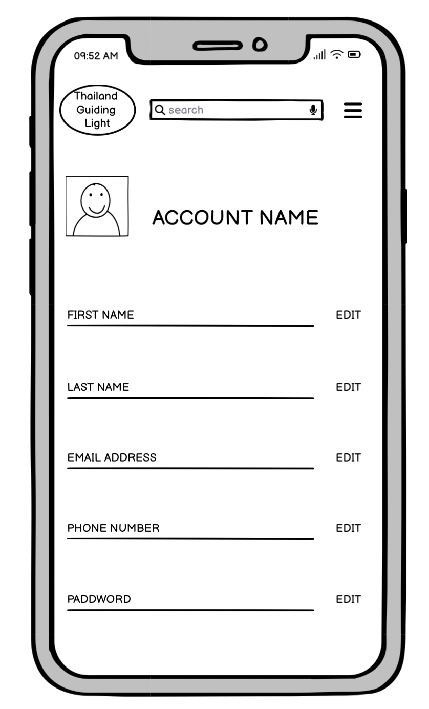

# Thailand Guiding Light

  ## About
  Thailand Guiding Light is a social network media website allowing customers who love to travel to Thailand or live in Thailand to share their passion. They can also view, comment, like, share pictures, share external content, videos or literary posts, and connect and navigate to other social links or websites. It is a platform to sell Thailand travel packages online, promote Thailand tour businesses, and sell all tourist-relevant firms or products by navigating the user to their website. The user can create a network and improve communication to find people with similar interests online.
  The website allows users and organizations to connect, communicate, and share information and relationships. People can connect with others in the same area or worldwide, families, friends, and those with the same interests. Also, eCommerce customers advertise and navigate the customer to their website. It has a login system. The website has a personal functionality that allows the admin and user to edit and manage their account. Deployed website:[ Link to website](
)
## UX  
  The website was created to be eye-catching and user-friendly. The user is given a simple procedure when they want to share their experience picture and videos. The emphasis is on the user experience. The user can navigate the website easily to fulfil the user's goal; the website is designed to be ready to use and easy to understand.

## Target Audience
  A Thailand Guiding Light's target audience is people who want to share Their passion for travel and living in Thailand. This group will have specific shared characteristics that connect them and make them relevant to their friends, relatives, customers and colleagues. You can find people who share their same interests online and sell Tourist relevant 
  product or tour package online, and promote brands and Thailand tour businesses.
## User Stories ## 
 ### As a first time user ###
- First time user 
  - As a First Time Visitor, I want to quickly understand the app's primary purpose so that I can learn more about how to get benefit from this app.
  - As a First Time Visitor, I want to navigate through the app to find the content easily.
  - As a First Time Visitor, I want to find this useful for my needs.
  - As a First Time Visitor, I want to be able to easily to create an account by providing basic information such as my name, email address , and password.
  - As a First Time Visitor, I want to be informed if I am making any errors when create my account so that I can fix any mistakes quickly.
  - As a Firs Time Visitor, I want to have a personalized profile where I can add a profile picture, cover photo, and write a bio to introduce myself to others.
  - As a First Time Visitor, I want to see the variety of places in Thailand, such as images, VDO, and short stories that are most valuable to visit.
  - As a First Time Visitor, I want to share my photo, videos, and comment on a beautiful place in Thailand.
  - As a First Time Visitor, I want to quickly and easily connect to people and link them to book the holiday trip (Hotel, Flight, Taxi, Guide, and All facilities).
  - As a First Time Visitor, I want to be able to access social media websites from various devices, such as desktop computers and smartphones, with a consistent user experience.

- Regular User (customer)
  - As a Regular User, I want to access my account without having to log in every time so that I can quickly post and share pictures, videos, and short stories.
  - As a Regular User, I want to safely protect my account details from sharing pictures, videos and short stories.
  - As a Regular User, I want to view my data to quickly check my account details and add or amend the information.
  - As a Regular User, I want to be able to search for a connection with a friend, a place or a relative story by name, username, or email address to get the most appropriate choices so that I am likely to find what I am looking for.
  - As a Regular User, I want to send post updates, photos, external content and videos to share with my connector.
  - As a Regular User, I want to be able to search for people, places, and relevant organizations by text search so that I can connect to communicate with them.
  - As a Regular User, I want to see ratings and reviews on a photo or videos, the story of the place that the experience shares.
  - As a regular User, I want to customize my news post and have control over the privacy of my posts, being able to choose who can see them.
  - As a regular User, I want to be notified when someone interacts with my posts or sends me a message, so I can stay engaged and respond promptly.
  - As a regular User, I want to be able to report or block other users for inappropriate behavior, ensuring a safe and respectful community,

## Wire frames
 ### Laptop
- Home page

- Full view home page

- About page

- Contact page

- Sign up page

- Thai travel news page

- Warning bell nav bar popover 

- Information nav bar popover

- Hamburger nav bar popover

- Account management page

- Your connections list page

- Most popular place page

- Chat room popover

 ### Mobile

- Mobile home page

 

 

- Mobile hamburger menu popover nav

- Mobile your account

- Mobile sign up

- Mobile your connections list

- Mobile most popular place

- Mobile chat room

## Workflow

 

 ## Future Development
 - Chat bot

## Technologies used
 
### Languages
 - [Python 3.9.17](https://www.python.org/downloads/release/python-3917/): python framework used to create all the logic.
 - [JS](https://www.javascript.com/): the primary language used to  develop interactive components of the website.
 - [HTML](https://developer.mozilla.org/en-US/docs/Web/HTML): the markup language used to create the website.
 - [CSS](https://developer.mozilla.org/en-US/docs/Web/css): the styling language used to style the website.

 ### Frameworks and libraries:
 - [Django](https://www.djangoproject.com/):Django use to build content management systems.
 - [jQuery](https://jquery.com/):was used to control click events and sending AJAX requests.
 - [jQuery User Interface](https://jqueryui.com/):was used to create interactive elements.
    
 ### Database:
 - [SQLite](https://www.sqlite.org/index.html):was used to as a development database.
 - [PostgreSQL](https://www.postgresql.org/):the database used to store all the data.

 ### Other tools:
 - [Git](https://git-scm.com/):The version control system used to manage to code.
 - [Pip3](https://pypi.org/project/pip/):the package manager used to install the dependencies.
 - [Gunicorn](https://gunicorn.org/):the web server used to run the website.
 - [Psycopg2](https://www.psycopg.org/):the database driver used to connect to the database.
 - [Django-allauth](https://docs.allauth.org/en/latest/):the authentication library used to create the user accounts.
 - [Render](https://pypi.org/project/render/):was used to render the README file.
 - [GitHub](https://github.com/):used to host the website's source code.
 - [GitPod](https://www.gitpod.io/):the IDE used to develop the website.
 - [Cloudinary](https://cloudinary.com/):was used to store all the images for the website.
 - [Chrome Devtools](https://developer.chrome.com/docs/devtools/open/):was used to debug the website.
 - [Font Awesome](https://fontawesome.com/icons):was used to create the icons used in the website.
 - [Lucidchart](https://www.lucidchart.com/pages/):was used to make a flowchart for the README file.
 - :was used to make a color palette for the website.
 - [W3C Validator](https://validator.w3.org/):was used to validate HTML5 code for the website.
 - [W3c CSS validator](https://jigsaw.w3.org/css-validator/):was used to validate CSS code for the website.
 - [JShint](): was used to validate JS code for the website.
 - [PEP8](https://pep8.org/):was used to validate Python code for the website.
 - [Privacy Policy Generator](https://www.privacypolicygenerator.info/):was used to create the privacy policy.
 - [Django-extensions](https://django-extensions.readthedocs.io/en/latest/):was used to create a Entity-Relationship Diagram.
 - [iStock by Getty Images](https://www.istockphoto.com/):was used to get background images and all the images for the website.

 ## Features
 Please refer to the [FEATURES.md]()file for all test-related documentation.
- 
 ## design
- 
 ### Color Scheme
- 
 ### Typography
- 
### Imagery
- 

## Agile Methodology
- 
## Flowcharts
- 

## Information Architecture

### Database
- Doing the earliest stages of the project, the database was created using SQLite.
- The database was then migrated to PostgreSQL.

**Entity-Relationship Diagram**

### Data Modeling

## Testing
- Please refer to the [TESTING.md]()file for all test-related documentation.

## Deployment 
- The app was deployed to[Heroku](https://id.heroku.com/login)
- The database was deployed to [ElephantSQL](https://www.elephantsql.com/)
- The app can be reached by the [link](https://thailand-guiding-light-2fb0b0e33db8.herokuapp.com/)

**Please refer to the [DEPLOYMENT.md](DEPLOYMENT.md) for all deployment**
## Credits

## Content and Images
- [iStock by Getty Images](https://www.istockphoto.com/)

## Acknowledgments
- Code Institute tutor and Slack community members for their support and help.
- Code Institute mentor Julia Konovalova for her advice
- Pook Pak with an Entity-Relationship Diagram explanation.
- Yodsapon Naree with an API, Django allauth, login and logout form explanation.

## image
  - [Chiangmai Thailand](https://www.istockphoto.com/photo/hot-air-balloons-gm619250406-107950677?phrase=chiangmai+thailand)
  - [Rachaburi Thailand](https://www.istockphoto.com/photo/market-woman-at-damnoen-saduak-in-thailand-gm535808385-57328202?phrase=bangkok+Thailand)
  - [Golden buddha in bangkok Thailand](https://www.istockphoto.com/photo/reclining-buddha-wat-pho-temple-bangkok-thailand-gm467571456-60438042?phrase=bangkok+Thailand)
  - [Kanchanaburi Thailand](https://www.istockphoto.com/photo/the-train-commute-through-the-famous-the-death-railway-in-kanchanaburi-thailand-gm1131397513-299569459?phrase=kanchanaburi+thailand)
  - [James Bond island near Phuket](https://www.istockphoto.com/photo/famous-james-bond-island-near-phuket-gm1044376524-279537477?phrase=phuket+thailand)
  - [Similan island Phuket](https://www.istockphoto.com/photo/similan-islands-phuket-thailand-views-gm1566579959-527586195?phrase=phuket+thailand)

  - [Surin beach in Phuket](https://www.istockphoto.com/photo/aerial-view-of-surin-beach-in-phuket-province-in-thailand-gm1365412456-436284501?phrase=phuket+thailand)
  - [Sino poetuguese Phuket](https://www.istockphoto.com/photo/phuket-old-town-with-old-clock-tower-buildings-in-sino-portuguese-style-restoration-gm1153025033-313024124?phrase=phuket+thailand)
  - [Koh Chang Thailand](https://www.istockphoto.com/photo/koh-chang-gm1659281885-534824316?phrase=Koh+chang+island+thailand)
  - [Wat Rong Khun Thailand](https://www.istockphoto.com/photo/wat-rong-khun-or-white-temple-landmark-chiang-rai-thailand-gm526443477-52763864?phrase=chiang+rai+thailand)
  - [Keren long neck woman Chaingrai Thailand](https://www.istockphoto.com/photo/karen-long-neck-woman-selling-handicrafts-in-hill-tribe-village-chiang-rai-thailand-gm1496955496-519473110?phrase=chiang+rai+thailand)
  - [Asia elephant family Chiangmai Thailand](https://www.istockphoto.com/photo/asia-elephant-family-live-in-the-elephant-camp-in-chiang-mai-gm1497301330-519714578?phrase=elephant+thailand)
  - 
  - 
  - 

    