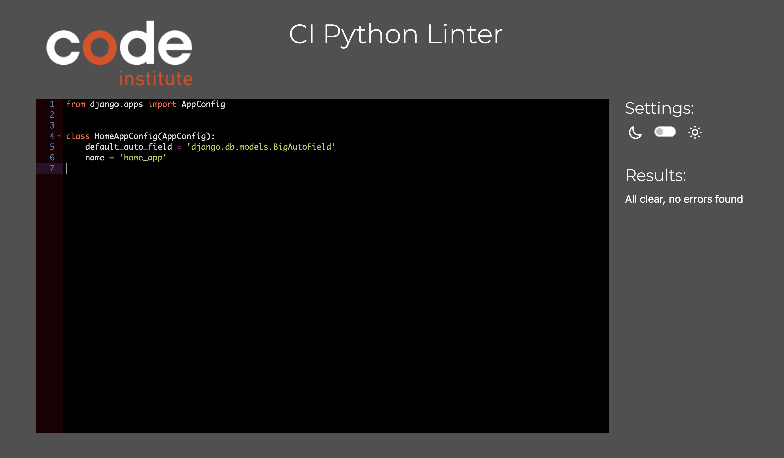
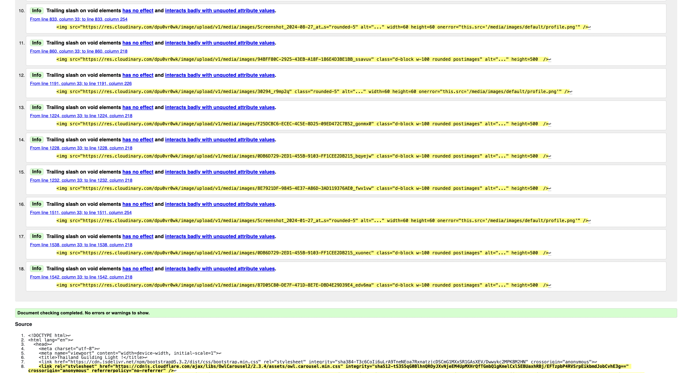
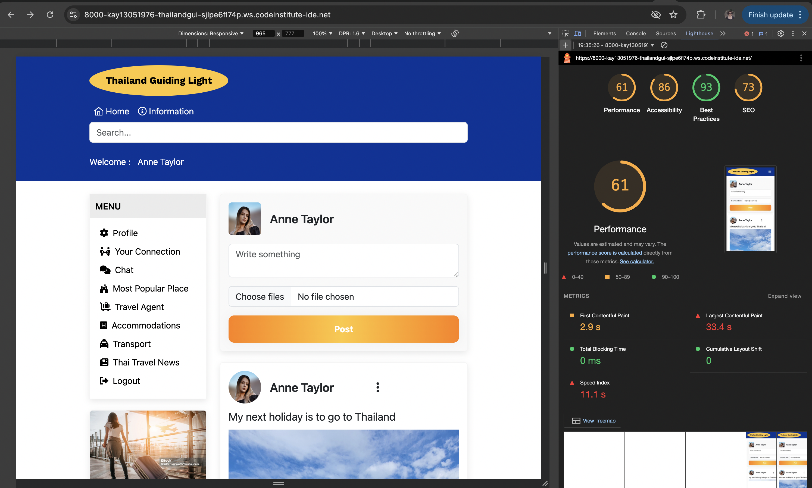
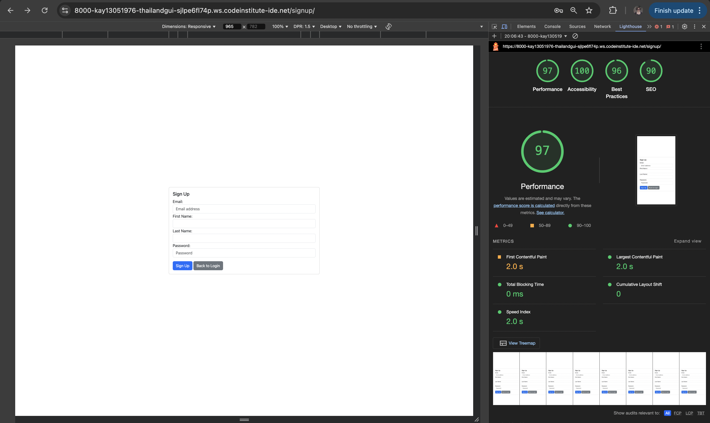
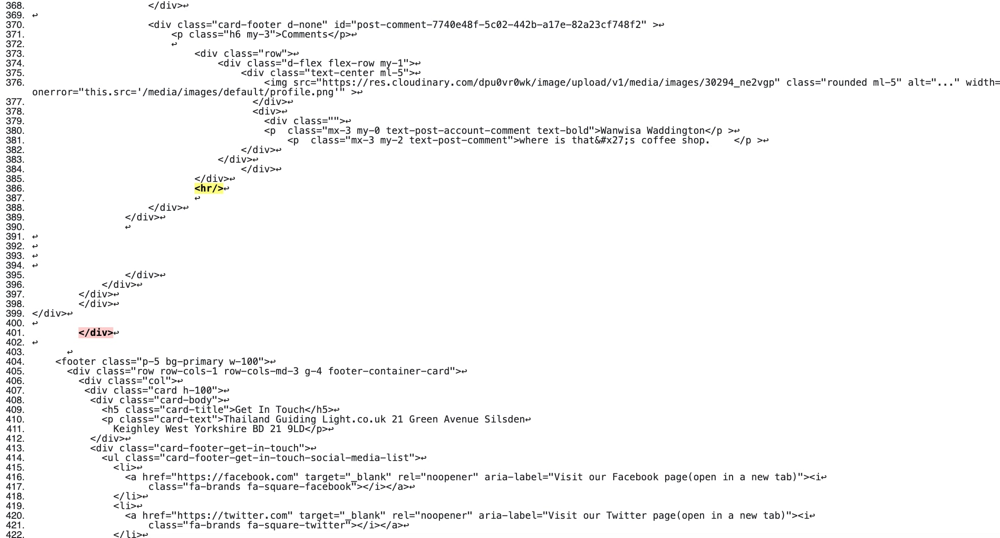

# TESTING
## Manual Testing

Testing was done throughout site development, for each before it was feature before it was merged into the master file
Usability was tested with the below user acceptance testing, sent to new users to ensure testing from different users, on different devices and browser to ensure issues were caught and where possible fixed during development.
| Page | User Actions | Expected Results | Y/N | Comments |
| ---- | ------------ | ---------------- | --- | -------- |
| Sign In/Sign Up| | | |    |      
| 1. Log out| Click on log out button | Redirection to Log Out page | Y   | |
| 2. Sign In | Click on Sign in button | Redirection to Sign in page | Y   | |
| 3. Sign Up |  Click on Sign up button | Redirection to Sign Up page | Y   | |
| Header navbar |  | |    | |
| 1. Logo | Click on Logo button | Redirection to Home page | Y   | |
| 2. Home | Click on Home button | Redirection to Home page | Y   | |
| 3. Information     | Click on Information button | Redirection to Information website | Y   | |
| 4. Account Owner Name    | Click on Account Owner Name button | Redirection to Account Owner Profile page | Y   | |
| Left Navbar Admin Section |  | |    | |
| 1. Admin site     | Click on Admin site button | Redirection to Django Admin site | Y   | |
| 2. Comment Management | Click on Comment Management button | Redirection to Admin Comment Management page | Y   | |
| Left Navbar User Section |  | |    | |
| 1. Profile | Click on Profile button | Redirection to Your profile page | Y   | |
| 2. Your Connection | Click on Your Connection button | Redirection to Your Connection page | Y  | |
| 3. Chat  | Click on Chat button | Redirection to Home page | N | This is only dummy link nav and will be future improvement  |
| 4. Most Popular Place    | Click on Most Popular Place button | Redirection to Most Popular Place page | Y   | |
| 5. Travel Agent   | Click on Travel Agent button | Redirection to Travel Agent website | Y   | |
| 6. Accommodations | Click on accommodations button | Redirection to Accommodations website | Y   | |
| 7. Transport   | Click on Transport button | Redirection to Transport booking website  | Y   | |
| 8. Thai Travel News   | Click on Thai Travel News button | Redirection to Thai Travel News website | Y   | |
| 9. Log Out     | Click on Log Out button | Redirection to Log Out page | Y   | |
| Main Section |  | |    | |
| Account Owner's Post Creation Section |  | |    | |
| Three Dots Vertical| hover on | Delete post and Edit Post appear | Y   | |
| 1. Delete Post| Click on delete post button | The post has been deleted | Y   | |
| 2. Edit Post| Click on edit post button | Redirection to Edit Your post page | Y   | |
| Edit Your Post Page |  | |    | |
| 1. Delete Image Icon | Click on delete image icon  button | The image has been deleted | Y   | |
| 2. Update Post | Click on update post button | The post has been updated | Y   | |
| Display Post Section |  | |    | |
| 1. Heart icon | Click on heart icon button | The count badge has been updated | Y   | |
| 2. Comment icon | Click on comment icon button | All comment has been display | Y | 
| 3. Comment Input Bar | Type your comment in the input bar and press Enter | The comment will be added, and the comment count badge will update accordingly | Y |
| 4. Share icon | hover on share icon | the copy link will display  | Y |
| 5. Copy Link | click on copy link button | The link has been copied | Y |
| 6. Connect icon | Click on connect icon button | Click the 'Connect' icon to send a friend request. Once accepted, the count badge will be updated | Y   | |
| Footer |  | |    | |
| Get in touch |  | |    | |
| 1. Facebook | Click on Facebook button | Redirection to Facebook website | Y   | |
| 2. Twitter | Click on Twitter button | Redirection to Twitter website | Y   | |
| 3. Youtube | Click on Youtube button | Redirection to Youtube website | Y   | |
| 4. Instagram | Click on Instagram button | Redirection to Instagram website | Y   | |
| Customer Service |  | |    | |
| 1. Thailand Guiding Light Ads | Click on Thailand Guiding Light button | Redirection to  Thailand Guiding Light page | N | This is only dummy link nav and will be future improvement  |
| 2. Thailand Guiding Light Support | Click on Thailand Guiding Light Support  button | Redirection to Thailand Guiding Light Support  page | N | This is only dummy link nav and will be future improvement  |
| 3. About Us | Click on About Us button | Redirection to About Us page | Y   | |
| 4. Contact Us | Click on Contact Us button | Redirection to Contact Us page | Y   | |
| Information |  | |    | |
| 1. General Terms & Conditions | Click on General Terms & Conditions button | Redirection to General Terms & Conditions page | N | This is only dummy link nav and will be future improvement  |
| 2. Data Protection & GDPR | Click on Data Protection & GDPR button | Redirection to Data Protection & GDPR page | N | This is only dummy link nav and will be future improvement  |

## Testing
### Chrome

### Firefox

### Brave

## Python validation Testing
pep8ci Python Linter
- admin.py

- apps.py

- forms.py

- models.py

- tests.py

- urls.py(home app)

- views.py

- asgi.py

- urls.py(social media project)

- wsgi.py

- settings.py

## HTML validation
- Home page

- Most popular page

- Comment Management page

**The error appear because of Django form variable**

## CSS validation

## Lighthouse Report
### Lighthouse admin home page report

### Lighthouse user home page report

### Lighthouse new user home page report

- Your Profile Page

- Most Your Connection Page

- Sign up page

- Most popular place page

## Solved bugs
- Removed stray end tag in base.html

## Future Improvement
- Add a function to edit the post for the user.
- Add reply comments in post comment sections.
- Create your connection app and manage the connection function.
