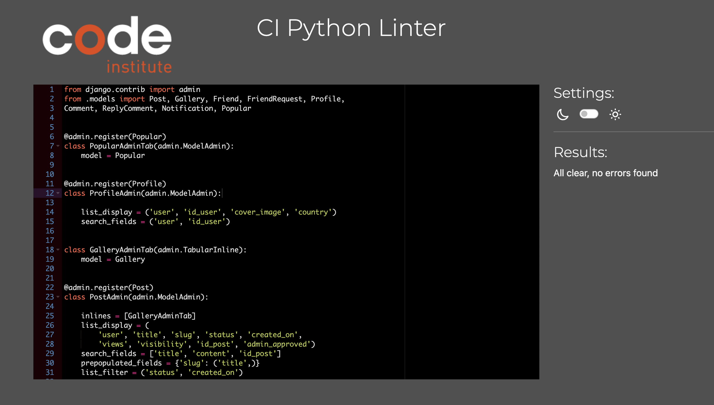
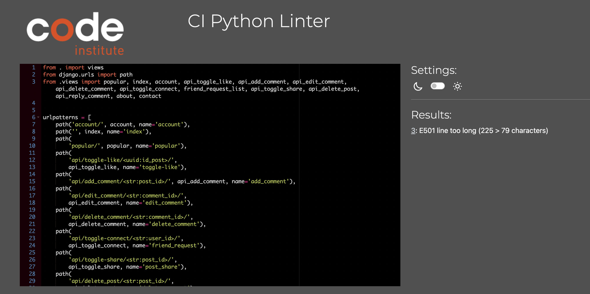

# TESTING
## Manual Testing

Testing was done throughout site development, for each before it was feature before it was merged into the master file
Usability was tested with the below user acceptance testing, sent to new users to ensure testing from different users, on different devices and browser to ensure issues were caught and where possible fixed during development.
| Page | User Actions | Expected Results | Y/N | Comments |
| ---- | ------------ | ---------------- | --- | -------- |
| Sign in | | | |          |
| 1      | Click on Sign in button | Redirection to Sign in page | Y   | |
| 2      |  Click on Sign up button | Redirection to Sign Up page | Y   | |
| Log out| Click on log out button | Redirection to Log Out page | Y   | |
| Header navbar |  | |    | |
| 1. Home     | Click on Home button | Redirection to Home page | Y   | |
| 2 Information     | Click on Information button | Redirection to information website | Y   | |
| 3. Admin site     | Click on Admin site button | Redirection to Sjango admin site | Y   | |
| 4. Log Out     | Click on Log Out button | Redirection to Log Out page | Y   | |
| Your Account | Click on Account button | Redirection to Your account page | Y   | |
| Your Connection | Click on Your Connection button | Redirection to home page | This is only dummy link nav and will be future improvement  | |
| Chat  | Click on Chat button | Redirection to Home page | This is only dummy link nav and will be future improvement  | N |
| Most Popular Place    | Click on Most Popular Place button | Redirection to most popular place page | N   | |
| Transport   | Click on Transport button | Redirection to Transport booking website  | Y   | |
| Thai Travel News   | Click on Thai Travel News button | Redirection to Thai travel news website | Y   | |

## Testing
### Chrome

### Firefox

### Brave

## Python validation Testing
pep8ci Python Linter

## Lighthouse Report
### Lighthouse new user page report

### Lighthouse user page report

### Lighthouse admin page report

## Solved bug

## unsolved bug
- The warning of Dangerous page in Heroku and it will be future improvement
## Mistake

## Future Improvement
